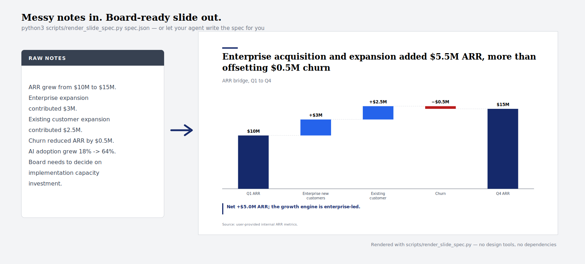
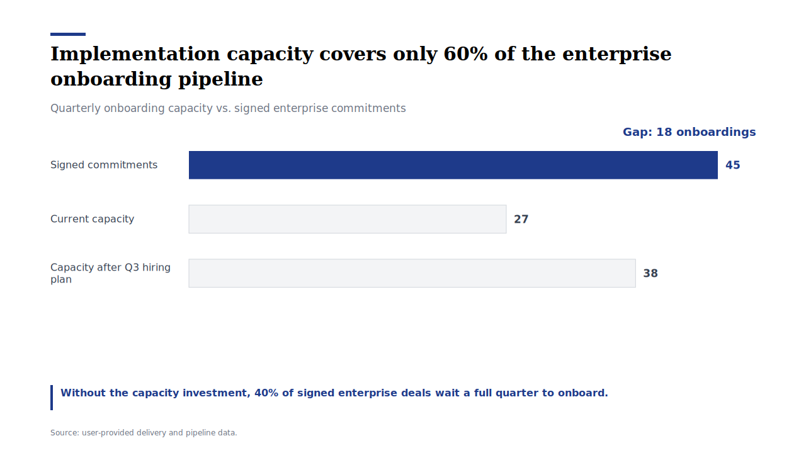
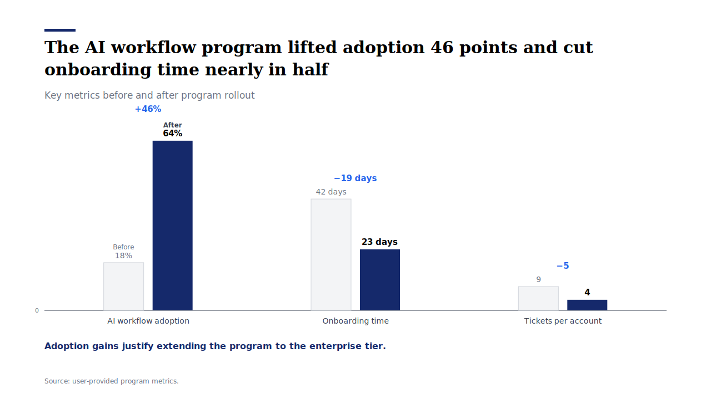
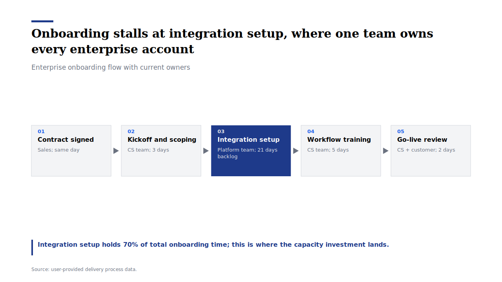
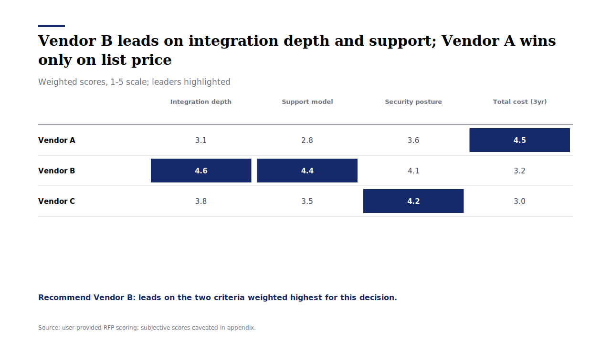
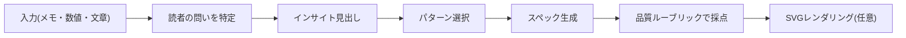

# 戦略コンサル型ビジュアライゼーション・スキル

[English](README.md) | 日本語

> 雑なメモ・数値・文章を、役員会レベルのビジュアライゼーションに変える Agent Skill。スライドだけでなく、レポート・提案書・研修資料・技術ドキュメント・インフォグラフィックまで対応します。



## できること

- **インサイト主導の見出し**:説明的なタイトルではなく、意思決定に答えるメッセージを作る
- **パターン選択**:ウォーターフォール、2x2、ベンチマーク表、ギャップ、タイムライン、プロセスフロー、ファネル、コンセプトマップなど28パターンから最適なものを選ぶ
- **どんな入力でも**:数値データ、文章、プロセス記述、会議メモ、学習ノート — [入力トリアージ](references/input-triage.md)が入力の種類をパターンに対応付けます
- **どんな資料でも**:役員会資料、社内レポート、研究レポート、営業提案、研修教材、技術文書、ワンページャー、インフォグラフィックの[12プロファイル](references/document-type-profiles.md)
- **実際にレンダリング**:スペック JSON から SVG スライドを生成するレンダラー付き(依存ライブラリ不要)

## 30秒クイックスタート

スキルをインストール:

```bash
git clone https://github.com/kgraph57/mckinsey-style-visualization-skill.git ~/.claude/skills/strategy-consulting-visualization
```

サンプルスペックをレンダリング:

```bash
python3 scripts/render_slide_spec.py examples/render-specs/arr-waterfall.json -o slide.svg
```

エージェントへの依頼例:

```text
このスキルを使って、次のメモを役員会向けのスライドスペックにして:
- ARRは$10Mから$15Mに成長
- エンタープライズ新規が$3M貢献
- 既存顧客の拡張が$2.5M貢献
- チャーンで$0.5M減少
- 取締役会は実装キャパシティへの投資を判断する必要がある
```

## レンダリング例

| ARRウォーターフォール | キャパシティギャップ |
| --- | --- |
|  |  |

| ビフォーアフター | プロセスフロー |
| --- | --- |
|  |  |

| ベンチマーク表 | エグゼクティブサマリー |
| --- | --- |
|  |  |

すべて `scripts/render_slide_spec.py` の出力そのままです。スペック JSON は [examples/render-specs/](examples/render-specs) にあります。対応パターンは12種:ウォーターフォール、ギャップ、ビフォーアフター、時系列、ベンチマーク表、サマリーストリップ、プロセスフロー、ファネル、ヒートマップ、ガント、KPIスコアカード、2x2。

## 職種別の使い方

[ペルソナ・プレイブック](references/persona-playbook.md)に、職種ごとのコピペ用プロンプトと実例があります。

| 職種 | 作れるもの | 実例 |
| --- | --- | --- |
| 営業 | パイプラインQBR、提案書ビジュアル | [ファネル](assets/rendered/sales-pipeline-funnel.svg) |
| PM/PMO | クリティカルパス付きロードマップ | [ガント](assets/rendered/pmo-rollout-gantt.svg) |
| マーケター | チャネル×セグメント分析 | [ヒートマップ](assets/rendered/marketing-channel-heatmap.svg) |
| 人事 | タレントスコアカード | [スコアカード](assets/rendered/hr-talent-scorecard.svg) |
| プロダクトマネージャー | 工数×インパクトの優先順位付け | [2x2](assets/rendered/product-priority-two-by-two.svg) |
| エンジニア | 障害ポストモーテムのフロー | [プロセスフロー](assets/rendered/eng-incident-flow.svg) |
| 研究職・医療職 | 研究アウトカムのサマリー | [ビフォーアフター](assets/rendered/research-outcomes-before-after.svg) |

日本特有のビジネス文書(稟議書・週報・月報・学会抄録・抄読会・社内勉強会・提案書)のプロファイルも[document-type-profiles.md](references/document-type-profiles.md)に用意しています。

## 仕組み



| レイヤー | 役割 | ファイル |
| --- | --- | --- |
| スキル本体 | エージェントの使用条件とワークフロー | [SKILL.md](SKILL.md) |
| 入力トリアージ | あらゆる入力をパターンに対応付け | [input-triage.md](references/input-triage.md) |
| 文書プロファイル | 資料タイプ別のフォーマット・密度・トーン | [document-type-profiles.md](references/document-type-profiles.md) |
| パターン集 | 28の可視化パターンと使い分け | [visualization-patterns.md](references/visualization-patterns.md) |
| スタイルシステム | 配色・タイポグラフィ・レイアウト規則 | [style-system.md](references/style-system.md) |
| プロンプトテンプレート | 再現可能なスペック形式 | [prompt-templates.md](references/prompt-templates.md) |
| 品質ルーブリック | 20点満点の出力採点 | [quality-rubric.md](references/quality-rubric.md) |
| レンダラー | スペック JSON → SVG スライド | [render_slide_spec.py](scripts/render_slide_spec.py) |

## デザイン原則

- 白背景・黒文字・ロイヤルブルー(`#1E3A8A`)のアクセント、抑制されたグレー階層
- 軸の正直なスケーリング、直接ラベル、凡例探しをさせない
- 装飾ではなく情報密度と階層で勝負
- 数値はすべて入力データか明示された仮定に紐づく(データの捏造をしない)

## 検証

```bash
python3 scripts/validate_skill.py
```

## 免責事項

本パッケージは独立したスキルパッケージであり、McKinsey & Company、Boston Consulting Group、Bain & Company その他いかなるコンサルティングファームとも提携・承認・後援関係にありません。

## ライセンス

MIT。[LICENSE](LICENSE) を参照してください。
