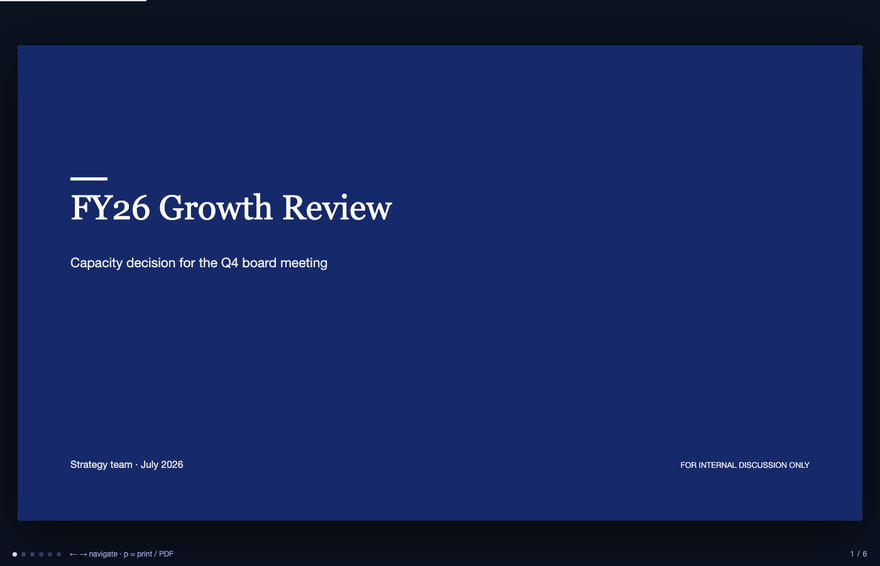
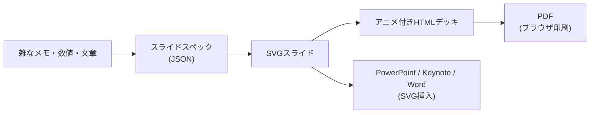
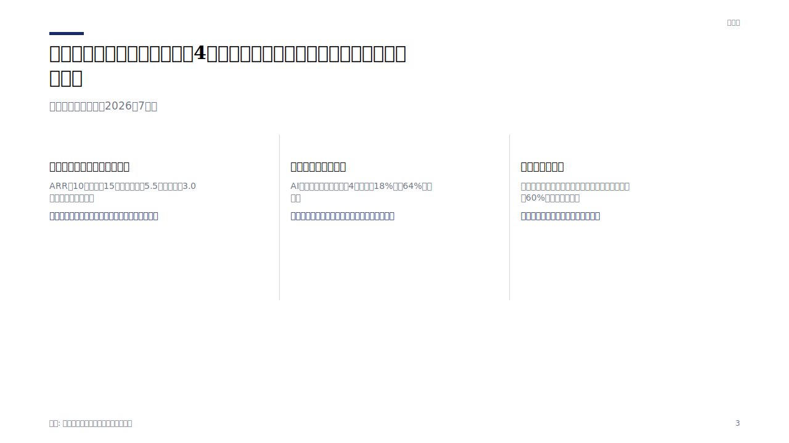
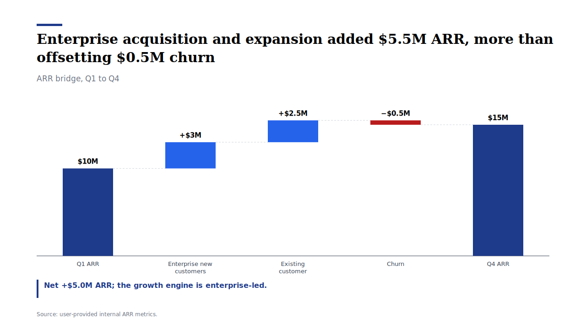
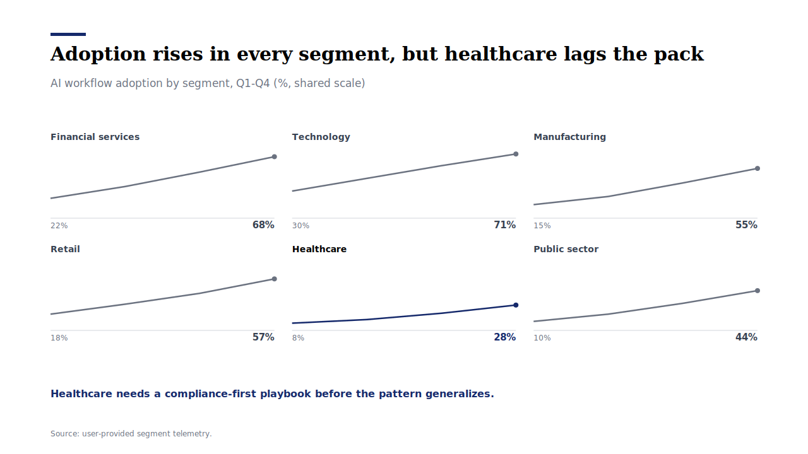
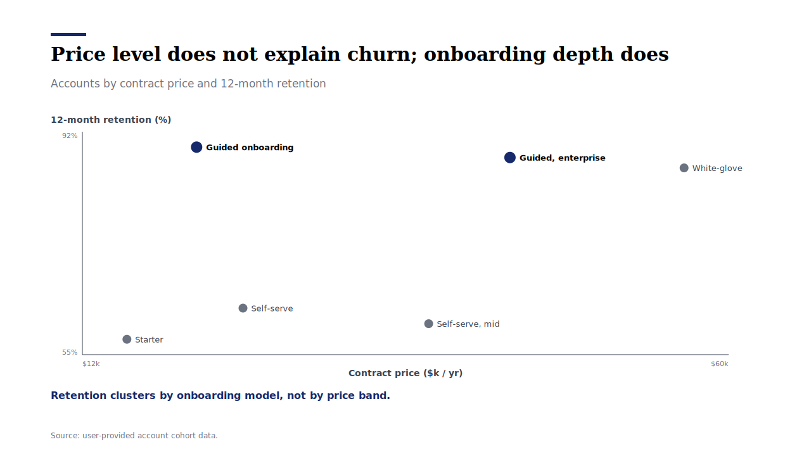
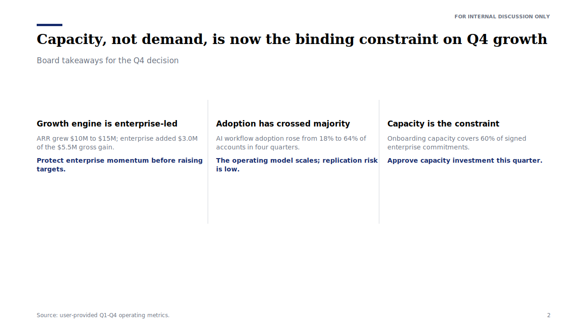
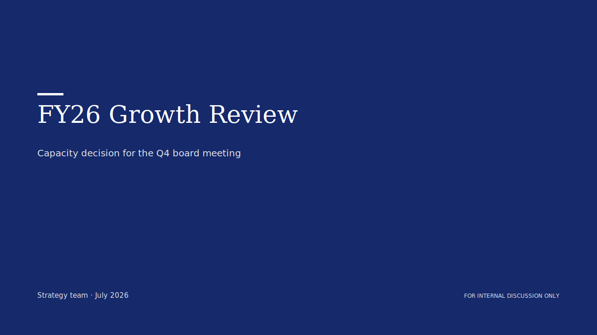

<div align="center">

# 戦略コンサル型ビジュアライゼーション・スキル

**雑なメモを入れる。役員会スライドが出てくる。**

AIエージェントに載せるひとつのスキルで、メモ・数値・文章をコンサル品質のビジュアルに変換 — 本物のSVGスライドとして、**アニメーション付きHTMLデッキ**として、あるいはデザイナーやツールがそのまま実行できるスペックとして。

Python 3 標準ライブラリのみ。**依存ゼロ・APIキー不要・ネットワーク通信なし。**

[](https://github.com/kgraph57/mckinsey-style-visualization-skill/actions/workflows/ci.yml)
[](https://github.com/kgraph57/mckinsey-style-visualization-skill/releases/tag/v1.9.0)

[English](README.md) | 日本語



*このリポジトリだけで作った実物のデッキ: `スペック(JSON) → SVGスライド → アニメ付きHTMLデッキ`。手描きは一切なし。*

</div>

## スターされる理由

- **実際に描画する。** ウォーターフォール、エグゼクティブサマリー、2×2、散布図、ヒートマップ、ガント、スモールマルチプル、カバーなど16パターンが本物のSVGスライドになります。下のギャラリーは全部レンダラーの出力そのままで、CIがpushごとに鮮度を検証します。
- **1コマンドでアニメーション付きHTMLデッキ。** スライドを1つの自己完結HTMLに束ねる: 静かな段階リビール、キーボード操作、進捗バー、外部リクエストゼロ。`p` を押す → ブラウザが印刷 → **そのままPDF**。
- **いつものスライドツールで使える。** SVGは **PowerPoint・Keynote・Word** に直接挿入可能。Googleスライドはブラウザで一度PNG化してから。
- **日本語のビジネス文書が第一級市民。** CJKは全角幅で計測して正しく折り返し、フォントはNoto Sans JP / ヒラギノにフォールバック。稟議書・役員会資料・週報・学会抄録の専用プロファイル付き。
- **監査に耐えるチャート。** バーの比率はデータと一致（Lie Factor ≈ 1.0）、ゼロ基線を明示、セル文字は全色域でWCAG AAコントラスト、アクセントのネイビーは白黒印刷でも判読可能 — すべて散文の約束ではなく**テストでアサート**。
- **5人のデザイン巨匠に酷評させて、全部直した。** Tufteのデータインク規律、元McKinseyのチャート親方、スイス派グリッド、FT流データジャーナリズム、現代デザインエンジニアリングの5視点パネルが5.8/10と欠陥リストを突きつけ、v1.9.0で全修正を出荷。[記録はこちら。](#5人のデザイン巨匠に酷評された)

## 60秒スタート

```bash
# 1. 取得（これがエージェントスキルとしてのインストールも兼ねる）
git clone https://github.com/kgraph57/mckinsey-style-visualization-skill.git ~/.claude/skills/strategy-consulting-visualization
cd ~/.claude/skills/strategy-consulting-visualization

# 2. スライド1枚をレンダリング → SVG
python3 scripts/render_slide_spec.py examples/render-specs/arr-waterfall.json -o slide.svg

# 3. アニメ付きフルデッキを生成 → HTML1ファイル
python3 scripts/build_html_deck.py --manifest examples/demo-deck.json -o deck.html
open deck.html   # ← 矢印キーで移動、"p" で印刷 → PDF
```

ターミナルを開かず、エージェントに頼むなら:

```text
このスキルを使って、次のメモを役員会向けスライドにして:
ARRは$10Mから$15Mに成長。エンタープライズ新規+$3M、既存拡張+$2.5M、チャーン-$0.5M。
取締役会は実装キャパシティへの投資を判断する。
```

## パイプライン



スペックはただのJSONなので、コードと同じようにdiff・レビュー・バージョン管理できます。

## ギャラリー

すべて `scripts/render_slide_spec.py` の出力そのまま。CIがレンダラー出力との一致を検証するので、ギャラリーが静かに腐ることはありません。スペックは [examples/render-specs/](examples/render-specs) にあります。

| 役員会サマリー（日本語） | ARRウォーターフォール |
| --- | --- |
|  |  |

| スモールマルチプル | 散布図 |
| --- | --- |
|  |  |

| エグゼクティブサマリー | カバースライド |
| --- | --- |
|  |  |

**SVG化できるのは16パターン**: カバー、ウォーターフォール、ギャップ、ビフォーアフター、時系列、ベンチマーク表、サマリーストリップ、プロセスフロー、ファネル、ヒートマップ、ガント、KPIスコアカード、2x2、散布図、分布、スモールマルチプル。残りの12パターン（サンキー、ピラミッド、地図、デシジョンツリー等）はスペックと画像生成プロンプトとして出力され、[カタログにどちらか明記](references/visualization-patterns.md)しています。誇張はしません。

## アニメーション付きHTMLデッキ

```bash
python3 scripts/build_html_deck.py cover.json bridge.json summary.json -o deck.html --title "Q4レビュー"
```

1コマンド・1ファイルで:

- **静かな段階リビール** — 派手なトランジションではなく品のある動き（`prefers-reduced-motion` 対応）
- **キーボード＋クリック操作**、進捗バー、ページカウンター、ディープリンク（`deck.html#3`）
- **印刷スタイルシート**: `p` か Cmd+P で1スライド1ページ → **PDF保存**
- **外部リクエストゼロ** — スタイルもスクリプトもSVGも全部インライン。メール添付・オフライン発表OK

コミット済みデモ: [examples/demo-deck.html](examples/demo-deck.html)（クローン後ローカルで開く）

## どこへでも書き出せる

| 出力先 | 方法 | 品質 |
| --- | --- | --- |
| PDF | HTMLデッキを開いて印刷 → PDF保存 | ベクター、1スライド1ページ |
| PowerPoint / Keynote / Word | SVGを画像として挿入 | ベクター、拡大しても劣化なし |
| Googleスライド / Docs | ブラウザでSVG→PNG化して挿入 | 任意解像度のラスター |
| Figma / Illustrator | SVGを直接開く | 完全編集可能なベクター |
| ドキュメント / wiki / GitHub | SVGをそのまま埋め込み | このREADMEで見ている通り |

## 5人のデザイン巨匠に酷評された

「きれいなチャート」ではなく**守り切れるチャート**を目指して、5視点のデザインレビューパネル（厳格なAIペルソナ）に容赦なく叩かせました:

| レビュアーの流派 | 評点 | 一番鋭い一撃 |
| --- | --- | --- |
| Edward Tufte — データインク・正直な軸 | 5.5/10 | 「意味のない装飾矩形がレンダラーに焼き込まれている」 |
| Gene Zelazny — 元McKinsey『Say It With Charts』 | 6.5/10 | 「旗艦サンプルが自分のヘッドライン規則に違反している」 |
| Vignelli × Müller-Brockmann — スイス派 | 6/10 | 「デザインシステムではなく企業テンプレート」 |
| Alan Smith — FTデータジャーナリズム | 5.5/10 | 「ウォーターフォールが負のブリッジで画面外に描画される」（実証付き） |
| 現代デザインエンジニアリング | 5.5/10 | 「2020年代の仕様書を着た2016年のビジュアル」 |

そして[v1.9.0](CHANGELOG.md)で**全部直しました**: ゼロフロアのウォーターフォール、CJK正対応の折返し、サイレント切り捨ての根絶、白黒印刷に耐える単一ネイビー、符号付きデータのdivergingヒートマップ、全色域WCAG AAのアサート、装飾の除去、チャート選択前の比較タイプゲート、データインク健全性とデッキ論理を測るルーブリック。

役員会でも、監査でも、デザイン批評家の前でも守り切れるビジュアルシステム — 一度批評を生き延びているからです。

## 職種別の使い方

[ペルソナ・プレイブック](references/persona-playbook.md)に、職種ごとのコピペ用プロンプトと実例があります。

| 職種 | 作れるもの | 実例 |
| --- | --- | --- |
| 営業 | パイプラインQBR、提案書ビジュアル | [ファネル](assets/rendered/sales-pipeline-funnel.svg) |
| PM/PMO | クリティカルパス付きロードマップ | [ガント](assets/rendered/pmo-rollout-gantt.svg) |
| マーケター | チャネル×セグメント分析 | [ヒートマップ](assets/rendered/marketing-channel-heatmap.svg) |
| 人事 | タレントスコアカード | [スコアカード](assets/rendered/hr-talent-scorecard.svg) |
| プロダクトマネージャー | 工数×インパクトの優先順位付け | [2x2](assets/rendered/product-priority-two-by-two.svg) |
| エンジニア | 障害ポストモーテムのフロー | [プロセスフロー](assets/rendered/eng-incident-flow.svg) |
| 研究職・医療職 | 研究アウトカムのサマリー | [ビフォーアフター](assets/rendered/research-outcomes-before-after.svg) |

日本特有のビジネス文書（稟議書・週報・月報・役員会資料・学会抄録・抄読会・社内勉強会・提案書）のプロファイルは [document-type-profiles.md](references/document-type-profiles.md) にあります。

## 仕組み


見出しが先、チャートは後。すべてのビジュアルは読者の意思決定から始まり、5つの比較タイプ（成分/項目/時系列/分布/相関）のゲートを通ってからパターンが決まります。スタイルの正本は [style-system.md](references/style-system.md)（8pxグリッド・固定タイプスケール・単一ネイビー・fill > line > text の強調ラダー）。

## 検証

```bash
python3 -m unittest discover -s tests
python3 scripts/validate_skill.py   # → OK: skill package passed validation
```

validatorは全サンプルspecとデモデッキをソースから再生成してコミット済み出力と突き合わせるので、ギャラリーとデッキは腐れません。

## スター・破壊報告・共有

雑なメモが使えるスライドになったら、**スターを**。壊れた出力・わかりにくい出力の報告は回帰テストになります（[Discussions](https://github.com/kgraph57/mckinsey-style-visualization-skill/discussions) / [リクエスト](https://github.com/kgraph57/mckinsey-style-visualization-skill/issues/new?template=example_request.md)）。

## 免責事項

本パッケージは独立したスキルパッケージであり、McKinsey & Company、Boston Consulting Group、Bain & Company その他いかなるコンサルティングファームとも提携・承認・後援関係にありません。

## ライセンス

MIT。[LICENSE](LICENSE) を参照してください。
