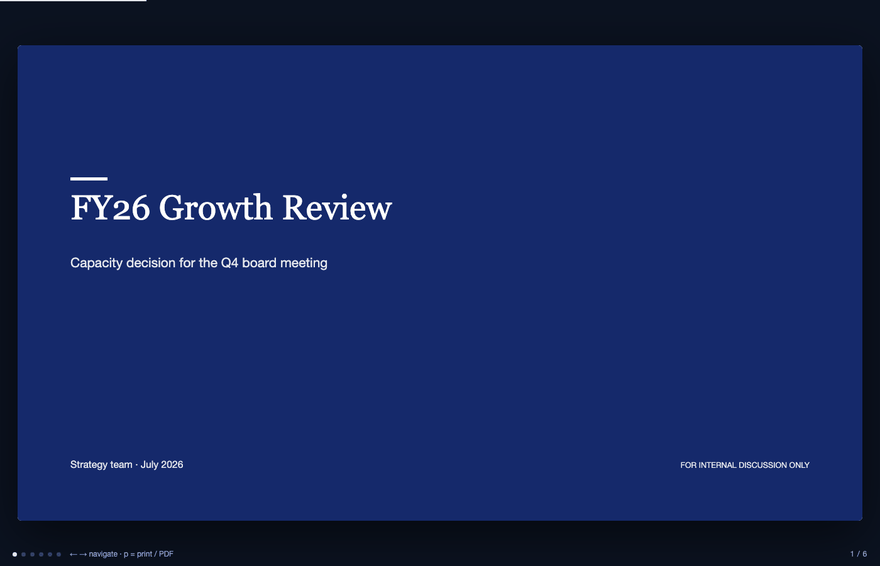
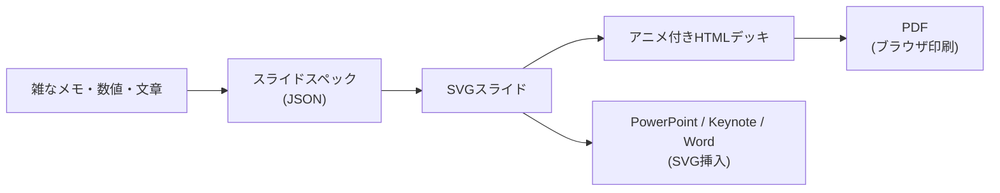
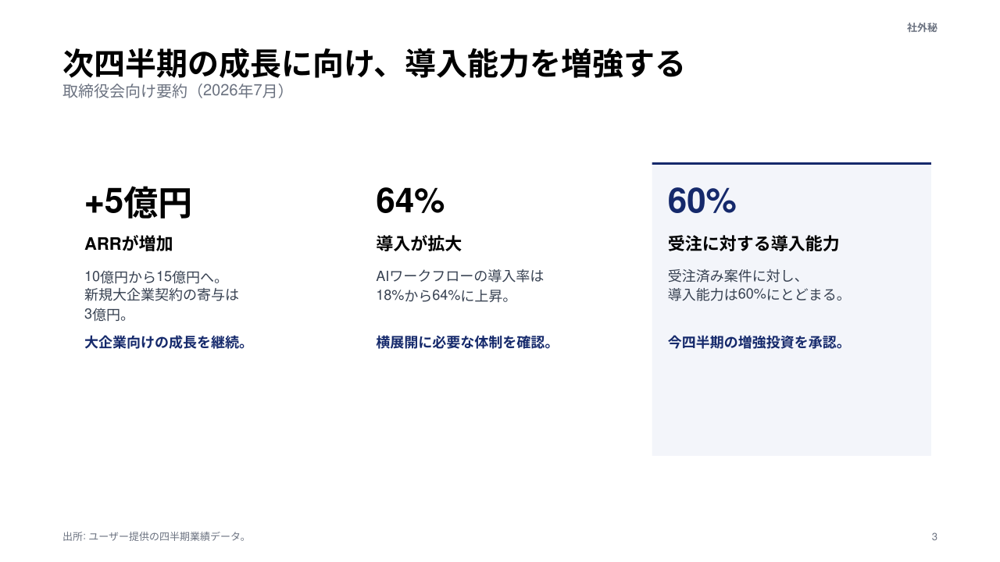
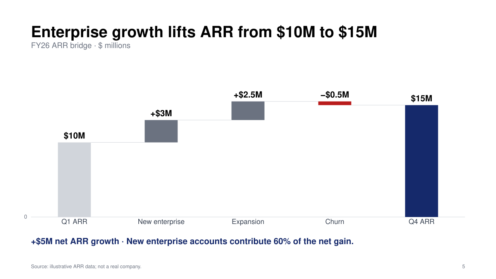
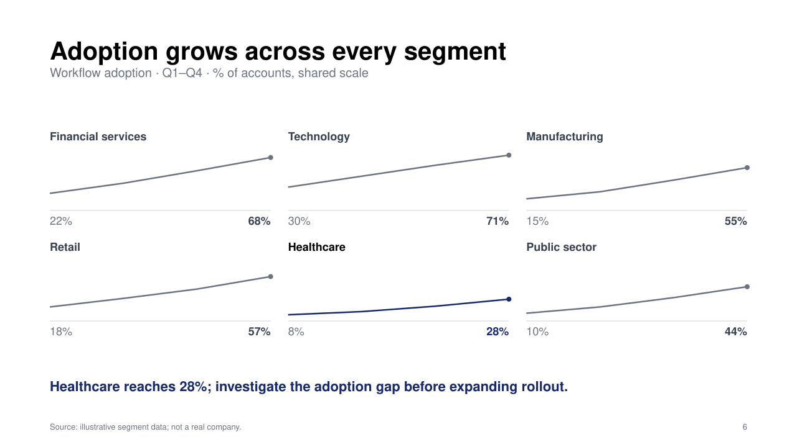
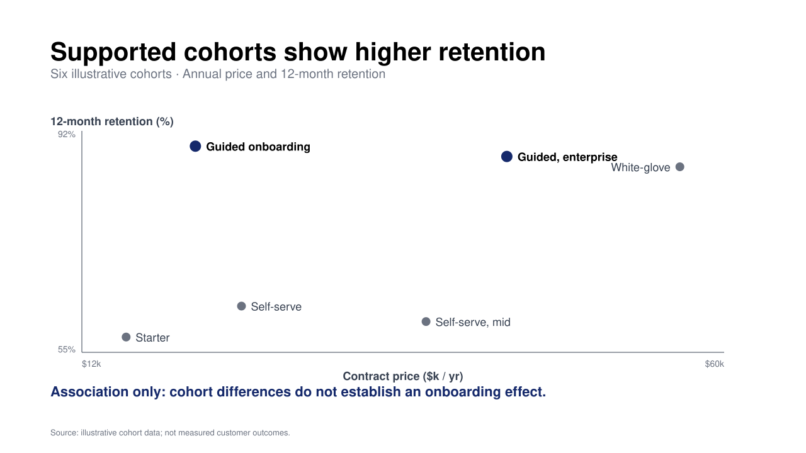
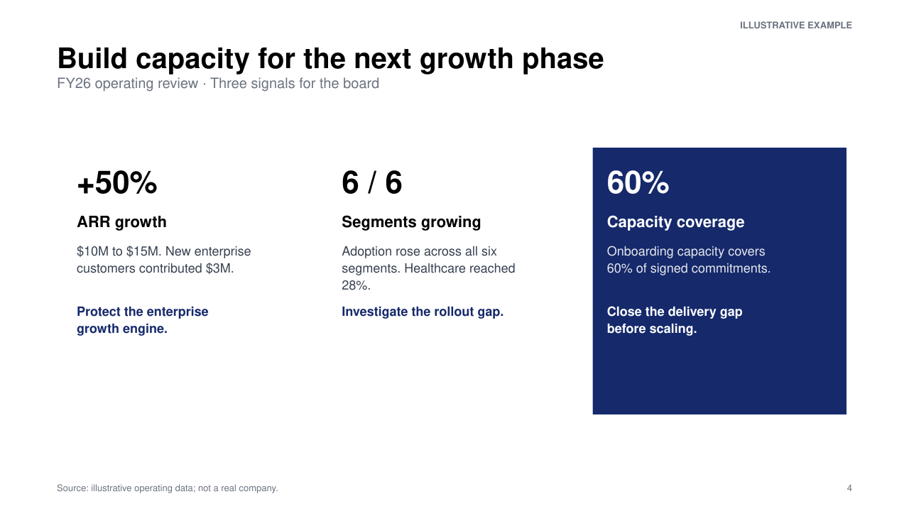
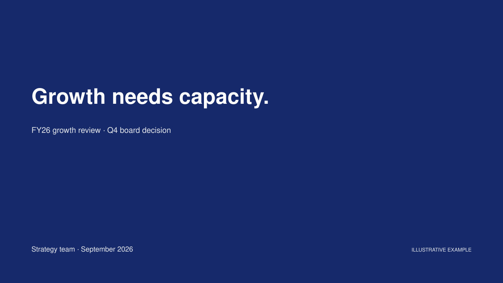

<div align="center">

# 戦略コンサル型ビジュアライゼーション・スキル

**雑なメモを入れる。役員会スライドが出てくる。**

AIエージェントに載せるひとつのスキルで、メモ・数値・文章をコンサル品質のビジュアルに変換 — 本物のSVGスライドとして、**アニメーション付きHTMLデッキ**として、あるいはデザイナーやツールがそのまま実行できるスペックとして。

Python 3 標準ライブラリのみ。**依存ゼロ・APIキー不要・ネットワーク通信なし。**

[](https://github.com/kgraph57/mckinsey-style-visualization-skill/actions/workflows/ci.yml)
[](https://github.com/kgraph57/mckinsey-style-visualization-skill/releases/tag/v2.4.0)

[English](README.md) | 日本語



_このリポジトリだけで作った実物のデッキ: `スペック(JSON) → SVGスライド → アニメ付きHTMLデッキ`。手描きは一切なし。_

</div>

## スターされる理由

- **インストールした瞬間に完全なデッキが手に入る。** `scripts/scaffold_deck.py <archetype>` が、カバーからクロージングまで揃った9〜12枚の完全なデッキ一式を作業ディレクトリにコピーします。ダミーデータを実データに差し替えてビルドするだけ。アーキタイプは6種（うち1つは日本語）。
- **実際に描画する。** ウォーターフォール、エグゼクティブサマリー、2×2、散布図、ヒートマップ、ガント、スモールマルチプル、カバー、セクション区切り、アジェンダ、クロージングなど22パターンが本物のSVGスライドになります。下のギャラリーは全部レンダラーの出力そのままで、CIがpushごとに鮮度を検証します。
- **ブラウザ完結のレポートモード。** `scripts/build_html_report.py` がMarkdownを、番号付きExhibit入りの自己完結HTML文書（A4印刷対応）に変換します。デッキと同じビジュアルシステムを、ドキュメント向けに。
- **1コマンドでアニメーション付きHTMLデッキ。** スライドを1つの自己完結HTMLに束ねる: 静かな段階リビール、キーボード操作、進捗バー、外部リクエストゼロ。`p` を押す → ブラウザが印刷 → **そのままPDF**。
- **いつものスライドツールで使える。** SVGは **PowerPoint・Keynote・Word** に直接挿入可能。Googleスライドはブラウザで一度PNG化してから。
- **日本語のビジネス文書が第一級市民。** CJKは全角幅で計測して正しく折り返し、フォントはNoto Sans JP / ヒラギノにフォールバック。稟議書・役員会資料・週報・学会抄録の専用プロファイル付き。
- **監査に耐えるチャート。** バーの比率はデータと一致（Lie Factor ≈ 1.0）、ゼロ基線を明示、セル文字は全色域でWCAG AAコントラスト、アクセントのネイビーは白黒印刷でも判読可能 — すべて散文の約束ではなく**テストでアサート**。
- **5人のデザイン巨匠に酷評させて、全部直した。** Tufteのデータインク規律、元McKinseyのチャート親方、スイス派グリッド、FT流データジャーナリズム、現代デザインエンジニアリングの5視点パネルが5.8/10と欠陥リストを突きつけ、以前のリリースで全修正を出荷済み。[記録はこちら。](#5人のデザイン巨匠に酷評された)

## 60秒スタート

```bash
# 1. 取得（これがエージェントスキルとしてのインストールも兼ねる）
git clone https://github.com/kgraph57/mckinsey-style-visualization-skill.git ~/.claude/skills/strategy-consulting-visualization
cd ~/.claude/skills/strategy-consulting-visualization

# 2. スライド1枚をレンダリング → SVG
python3 scripts/render_slide_spec.py examples/render-specs/arr-waterfall.json -o slide.svg

# 3. アニメ付きフルデッキを生成 → HTML1ファイル
python3 scripts/build_html_deck.py --manifest examples/demo-deck.json -o deck.html
open deck.html   # ← 矢印キーで移動、"p" で印刷 → PDF
```

ターミナルを開かず、エージェントに頼むなら:

```text
このスキルを使って、次のメモを役員会向けスライドにして:
ARRは$10Mから$15Mに成長。エンタープライズ新規+$3M、既存拡張+$2.5M、チャーン-$0.5M。
取締役会は実装キャパシティへの投資を判断する。
```

## パイプライン


```mermaid
flowchart LR
    A["雑なメモ・数値・文章"] --> B["スライドスペック<br/>(JSON)"]
    B --> C["SVGスライド"]
    C --> D["アニメ付きHTMLデッキ"]
    C --> E["PowerPoint / Keynote / Word<br/>(SVG挿入)"]
    D --> F["PDF<br/>(ブラウザ印刷)"]
```

スペックはただのJSONなので、コードと同じようにdiff・レビュー・バージョン管理できます。

## ギャラリー

すべて `scripts/render_slide_spec.py` の出力そのまま。CIがレンダラー出力との一致を検証するので、ギャラリーが静かに腐ることはありません。スペックは [examples/render-specs/](examples/render-specs) にあります。

| 役員会サマリー（日本語）                                      | ARRウォーターフォール                                    |
| ------------------------------------------------------------- | -------------------------------------------------------- |
|  |  |

| スモールマルチプル                                                    | 散布図                                                   |
| --------------------------------------------------------------------- | -------------------------------------------------------- |
|  |  |

| エグゼクティブサマリー                                       | カバースライド                                  |
| ------------------------------------------------------------ | ----------------------------------------------- |
|  |  |

**SVG化できるのは22パターン**: カバー、セクション区切り、裏表紙、アジェンダ、箇条書き、クロージング、引用、ウォーターフォール、ギャップ、ビフォーアフター、時系列、ベンチマーク表、サマリーストリップ、プロセスフロー、ファネル、ヒートマップ、ガント、KPIスコアカード、2x2、散布図、分布、スモールマルチプル。残りの13パターン（サンキー、ピラミッド、地図、デシジョンツリー等）はスペックと画像生成プロンプトとして出力され、[カタログにどちらか明記](references/visualization-patterns.md)しています。誇張はしません。

## 1コマンドで完全デッキ（スキャフォールド→ビルド）

スペックを白紙から書く必要はありません。アーキタイプを選んでコピーし、実データに差し替えるだけ:

```bash
python3 scripts/scaffold_deck.py --list                       # 6アーキタイプ+スライド枚数を表示
python3 scripts/scaffold_deck.py board-update -o my-deck --title "FY27役員会アップデート"
# my-deck/specs/*.json を実データに書き換える（パターンの型はそのまま使える）
python3 scripts/build_html_deck.py --manifest my-deck/deck.json -o my-deck/deck.html
```

`scaffold_deck.py` は中身のあるディレクトリを`--force`なしで上書きしません。完了時に次に打つ2コマンドを表示します。

## テンプレートギャラリー

6つのデッキアーキタイプが、一貫したダミーストーリー入りで同梱されています。すべてのスライドが描画可能で、スタブはありません。

| アーキタイプ              | 用途                                        | ストーリーライン                                                                                                                                    |
| ------------------------- | ------------------------------------------- | --------------------------------------------------------------------------------------------------------------------------------------------------- |
| `board-update`            | 定例の役員会・経営会議アップデート          | カバー→アジェンダ→エグゼクティブサマリー→KPIスコアカード→ARRウォーターフォール→トレンド→リスク→クロージング→裏表紙                                  |
| `strategy-recommendation` | 「Where to play, How to win」型の戦略デック | カバー→アジェンダ→背景→セクション区切り2枚（Where to play / How to win）→2×2→ベンチマーク表→ギャップまたはブリッジ→ロードマップ→クロージング→裏表紙 |
| `project-status`          | PMO・ステアリングコミッティ向け進捗報告     | カバー→サマリー→ロードマップ→KPIスコアカード→ブロッカー→グリーン化への道筋フロー→クロージング→裏表紙                                                |
| `market-entry`            | 新規参入・拡張の投資判断                    | カバー→アジェンダ→市場トレンド→競合ベンチマーク→セグメント2×2→参入方式フロー→分布または散布図→クロージング→裏表紙                                   |
| `sales-proposal`          | 顧客向け提案書                              | カバー→顧客の状況→ビフォーアフター→アプローチフロー→計画→採用理由ベンチマーク→顧客の声→クロージング→裏表紙                                          |
| `board-update-ja`         | 役員会向け月次アップデート（日本語）        | `board-update`と同じ構成を、翻訳調ではなく自然な日本語の見出しで                                                                                    |

## レポートモード（Markdown→ブラウザ文書）

デッキではなく文書がほしいときは、Markdownを書いて1コマンドでA4印刷対応の自己完結HTMLに変換します:

```bash
python3 scripts/build_html_report.py my-report.md -o my-report.html --lang ja
```

- フロントマター（`title`・`subtitle`・`author`・`date`・`classification`・`lang`）がネイビーのタイトル帯を作ります（文書内で唯一のネイビー面）
- `##`/`###` 見出しは自動採番され、アンカー付きの目次（Contents）が生成されます。箇条書き・番号付きリスト・表・太字/斜体・コード・引用・リンクなど標準的なMarkdownはすべて先にHTMLエスケープしてから解釈するので、入力に含まれるタグは実行されません
- `` で図を挿入すると、`Exhibit N — キャプション` として自動採番され、スライドSVGがそのまま埋め込まれます（ヘッダー/フッターのクロームなし）。`` で既存のSVGファイルも同様に埋め込めます
- `p` またはCmd+Pで、タイトル帯を1ページ目にしたA4縦のPDFとして書き出せます
- 外部リクエストはゼロ — HTMLデッキと同じ自己完結の保証です

`templates/reports/` に3種類のひな形（`board-pre-read.md`・`one-pager.md`・`proposal-memo.md`）が同梱されています。コミット済みデモ: [examples/demo-report.html](examples/demo-report.html)（[examples/demo-report.md](examples/demo-report.md)からビルド）。

## 発表原稿（登壇者が読む原稿）

どのスライドスペックにも、トップレベルの `"notes"` フィールド（文字列、または段落ごとの文字列リスト）を付けられます — そのスライドの発表原稿（ナレーション）です。SVGレンダラーはこのフィールドを完全に無視するので、notesを足してもレンダリング結果は変わりません。同じデッキマニフェストから、印刷前提の「1スライド1ページ」原稿をビルドします:

```bash
python3 scripts/build_speaker_script.py --manifest my-deck/deck.json -o my-deck/script.html --lang ja
```

- A4印刷1ページにつきスライド1枚: 上にスライド本体、下に登壇者が読める文字サイズの原稿（画面20px・印刷約13.5pt。`--lang ja` は行間1.9・`palt`でCJK対応）
- notesがないスライドも1ページとして表示され、薄いグレーで「（原稿なし）」と表示（無言でスキップしない）
- 表紙ページにはデッキタイトルと、デッキ自身のカバースライドにある日付（あれば）
- 外部リクエストゼロ、JavaScript不要

コミット済みデモ: [examples/demo-script.html](examples/demo-script.html)（[templates/decks/board-update-ja/deck.json](templates/decks/board-update-ja/deck.json)から`--lang ja`でビルド）。

## デッキを記事として読む（縦スクロール版）

同じ `notes` フィールドで、読み物モードのビルドもできます: デッキ全体を約680px幅の1カラムに縦に並べ、各スライドのSVGの下にnotesを地の文として続ける — サイドナビ付きの文書ではなく、実際のM3連載記事のような紙面優先のレイアウトです。

```bash
python3 scripts/build_html_article.py --manifest my-deck/deck.json -o my-deck/article.html --lang ja
```

- 冒頭はヒーロー: マニフェストの `series` キーから大文字のキッカー（任意）、タイトル、`lead`（任意。無ければ後方互換で `description` を使用）からリード文、カバースライドから著者・日付・全スライド数のメタチップ
- 全スライドがマニフェスト順に、680px幅のカラムに1つの `<article>` として表示されます（番号+任意の `label` → 見出し → SVG → notes地の文）。このモードに目次（Contents）はなく、上から下まで一本道で読みます
- notesがないスライドは枠だけ表示 — デッキをめくるように、記事でも全スライドを省略せず表示します
- スライドごとの任意フィールド `refs`（`[{"label": ..., "url": ...}]`）はnotesの下に「関連リンク」として表示され、URLをキーに重複排除した上で最後の「参考リンク一覧」に集約されます。http(s)/mailto以外のURLはリンク化されません
- `--title` でマニフェストのタイトルを上書き可能。外部リクエストは関連リンク自身の`href`を除きゼロ

コミット済みデモ: [examples/demo-article.html](examples/demo-article.html)（[templates/decks/board-update/deck.json](templates/decks/board-update/deck.json)からビルド）。

## アニメーション付きHTMLデッキ

```bash
python3 scripts/build_html_deck.py cover.json bridge.json summary.json -o deck.html --title "Q4レビュー"
```

1コマンド・1ファイルで:

- **静かな段階リビール** — 派手なトランジションではなく品のある動き（`prefers-reduced-motion` 対応）
- **キーボード＋クリック操作**、進捗バー、ページカウンター、ディープリンク（`deck.html#3`）
- **印刷スタイルシート**: `p` か Cmd+P で1スライド1ページ → **PDF保存**
- **外部リクエストゼロ** — スタイルもスクリプトもSVGも全部インライン。メール添付・オフライン発表OK

コミット済みデモ: [examples/demo-deck.html](examples/demo-deck.html)（クローン後ローカルで開く）

## どこへでも書き出せる

| 出力先                       | 方法                             | 品質                         |
| ---------------------------- | -------------------------------- | ---------------------------- |
| PDF                          | HTMLデッキを開いて印刷 → PDF保存 | ベクター、1スライド1ページ   |
| PowerPoint / Keynote / Word  | SVGを画像として挿入              | ベクター、拡大しても劣化なし |
| Googleスライド / Docs        | ブラウザでSVG→PNG化して挿入      | 任意解像度のラスター         |
| Figma / Illustrator          | SVGを直接開く                    | 完全編集可能なベクター       |
| ドキュメント / wiki / GitHub | SVGをそのまま埋め込み            | このREADMEで見ている通り     |

## 5人のデザイン巨匠に酷評された

「きれいなチャート」ではなく**守り切れるチャート**を目指して、5視点のデザインレビューパネル（厳格なAIペルソナ）に容赦なく叩かせました:

| レビュアーの流派                                | 評点   | 一番鋭い一撃                                                         |
| ----------------------------------------------- | ------ | -------------------------------------------------------------------- |
| Edward Tufte — データインク・正直な軸           | 5.5/10 | 「意味のない装飾矩形がレンダラーに焼き込まれている」                 |
| Gene Zelazny — 元McKinsey『Say It With Charts』 | 6.5/10 | 「旗艦サンプルが自分のヘッドライン規則に違反している」               |
| Vignelli × Müller-Brockmann — スイス派          | 6/10   | 「デザインシステムではなく企業テンプレート」                         |
| Alan Smith — FTデータジャーナリズム             | 5.5/10 | 「ウォーターフォールが負のブリッジで画面外に描画される」（実証付き） |
| 現代デザインエンジニアリング                    | 5.5/10 | 「2020年代の仕様書を着た2016年のビジュアル」                         |

そして[以前のリリース](CHANGELOG.md)で**全部直しました**: ゼロフロアのウォーターフォール、CJK正対応の折返し、サイレント切り捨ての根絶、白黒印刷に耐える単一ネイビー、符号付きデータのdivergingヒートマップ、全色域WCAG AAのアサート、装飾の除去、チャート選択前の比較タイプゲート、データインク健全性とデッキ論理を測るルーブリック。

役員会でも、監査でも、デザイン批評家の前でも守り切れるビジュアルシステム — 一度批評を生き延びているからです。

## 職種別の使い方

[ペルソナ・プレイブック](references/persona-playbook.md)に、職種ごとのコピペ用プロンプトと実例があります。

| 職種                   | 作れるもの                        | 実例                                                                   |
| ---------------------- | --------------------------------- | ---------------------------------------------------------------------- |
| 営業                   | パイプラインQBR、提案書ビジュアル | [ファネル](assets/rendered/sales-pipeline-funnel.svg)                  |
| PM/PMO                 | クリティカルパス付きロードマップ  | [ガント](assets/rendered/pmo-rollout-gantt.svg)                        |
| マーケター             | チャネル×セグメント分析           | [ヒートマップ](assets/rendered/marketing-channel-heatmap.svg)          |
| 人事                   | タレントスコアカード              | [スコアカード](assets/rendered/hr-talent-scorecard.svg)                |
| プロダクトマネージャー | 工数×インパクトの優先順位付け     | [2x2](assets/rendered/product-priority-two-by-two.svg)                 |
| エンジニア             | 障害ポストモーテムのフロー        | [プロセスフロー](assets/rendered/eng-incident-flow.svg)                |
| 研究職・医療職         | 研究アウトカムのサマリー          | [ビフォーアフター](assets/rendered/research-outcomes-before-after.svg) |

日本特有のビジネス文書（稟議書・週報・月報・役員会資料・学会抄録・抄読会・社内勉強会・提案書）のプロファイルは [document-type-profiles.md](references/document-type-profiles.md) にあります。

## 仕組み


```mermaid
flowchart LR
    A["入力(メモ・数値・文章)"] --> B["読者の問いを特定"]
    B --> C["単一命題のインサイト見出し"]
    C --> D["比較タイプ判定 → パターン選択"]
    D --> E["スペック生成"]
    E --> F["24点ルーブリックで採点"]
    F --> G["SVG / HTMLデッキ出力"]
```

見出しが先、チャートは後。すべてのビジュアルは読者の意思決定から始まり、5つの比較タイプ（成分/項目/時系列/分布/相関）のゲートを通ってからパターンが決まります。スタイルの正本は [style-system.md](references/style-system.md)（8pxグリッド・固定タイプスケール・単一ネイビー・fill > line > text の強調ラダー）。

## 検証

```bash
python3 -m unittest discover -s tests
python3 scripts/validate_skill.py   # → OK: skill package passed validation
```

validatorは全サンプルspecとデモデッキをソースから再生成してコミット済み出力と突き合わせるので、ギャラリーとデッキは腐れません。

## スター・破壊報告・共有

雑なメモが使えるスライドになったら、**スターを**。壊れた出力・わかりにくい出力の報告は回帰テストになります（[Discussions](https://github.com/kgraph57/mckinsey-style-visualization-skill/discussions) / [リクエスト](https://github.com/kgraph57/mckinsey-style-visualization-skill/issues/new?template=example_request.md)）。

## 免責事項

本パッケージは独立したスキルパッケージであり、McKinsey & Company、Boston Consulting Group、Bain & Company その他いかなるコンサルティングファームとも提携・承認・後援関係にありません。

## ライセンス

MIT。[LICENSE](LICENSE) を参照してください。
