# Strategy Consulting Visualization Skill

English | [日本語](README.ja.md)

> Marketplace-ready Agent Skill that turns messy notes, metrics, and prose into executive-ready visualizations — board slides, reports, proposals, training materials, technical diagrams, and infographics — with a built-in renderer that produces real SVG slides.


[](LICENSE)
[](https://github.com/kgraph57/mckinsey-style-visualization-skill/actions/workflows/ci.yml)
[](SKILL.md)
[](scripts/validate_skill.py)
[](https://github.com/kgraph57/mckinsey-style-visualization-skill/releases/tag/v1.8.0)


## Why Star This Repo

This is built to be a reusable visualization operating system for agents, not a prompt dump.

- **Messy input to executive spec**: turns notes, metrics, prose, or process descriptions into decision-ready visual specs.
- **Real rendered proof**: includes a dependency-free Python renderer and committed SVG outputs for 12 patterns.
- **Portable skill package**: `SKILL.md` stays concise while references load only when needed.
- **Marketplace-safe positioning**: uses strategy-consulting category language with explicit non-affiliation disclaimers.
- **Bias-resistant review**: expert lenses challenge assumptions, overclaims, accessibility, and localization risks.
- **Quality gates included**: local tests and validation catch broken specs, stale renders, risky claims, and package drift.

## 30-Second Quickstart

Install the skill:

```bash
git clone https://github.com/kgraph57/mckinsey-style-visualization-skill.git ~/.claude/skills/strategy-consulting-visualization
```

Render your first slide — no dependencies beyond Python 3:

```bash
python3 scripts/render_slide_spec.py examples/render-specs/arr-waterfall.json -o slide.svg
```

Or ask your agent:

```text
Use the strategy consulting visualization skill to turn these notes into a board slide spec:
ARR grew from $10M to $15M. Enterprise added $3M, expansion $2.5M, churn -$0.5M.
The board must decide on implementation capacity investment.
```

If you are not sure what to ask, use this:

```text
Use the strategy consulting visualization skill. First identify the reader and decision, then choose the simplest useful visual. Challenge assumptions, avoid overclaiming, and include expert review notes.
Here is the raw material:
[paste notes, metrics, prose, or process]
```

## Bias-Resistant Review

The skill includes an [expert review loop](references/expert-review-loop.md) that acts like a panel of research, executive, finance, product, visualization, accessibility, cross-cultural, and legal/security reviewers. It is not about adding ceremony; it removes unsupported certainty, insider jargon, color-only meaning, cultural shorthand, and hidden assumptions before the visual is treated as publishable.

## Distribution Package

This repository is packaged for distribution testing and buyer review:

- [Marketplace listing draft](MARKETPLACE.md)
- [Marketplace target list](MARKETPLACE_TARGETS.md)
- [Launch kit](LAUNCH.md)
- [Submission copy](SUBMISSION.md)
- [Distribution kit](DISTRIBUTION.md)
- [Commercialization plan](COMMERCIALIZATION.md)
- [Buyer brief](BUYER_BRIEF.md)
- [Traction tracker](TRACTION.md)
- [Growth playbook](GROWTH.md)
- [Security policy](SECURITY.md)
- [Roadmap](ROADMAP.md)

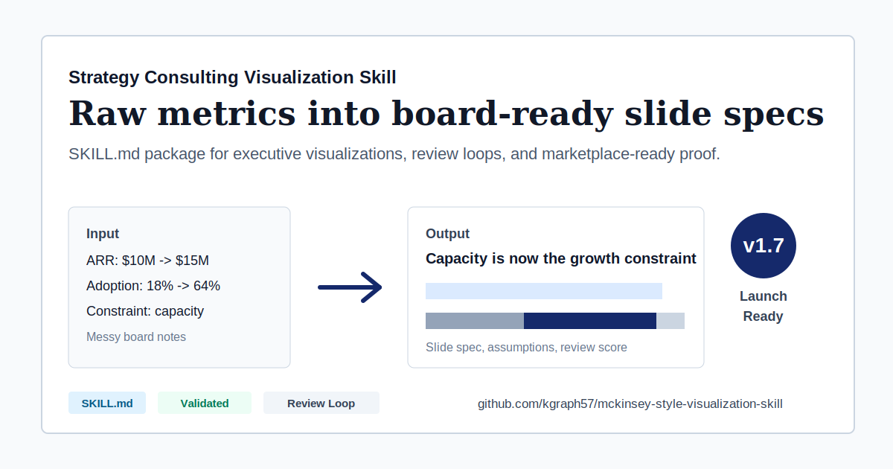

## Rendered Output Gallery

These are actual outputs of `scripts/render_slide_spec.py`, committed as-is. Spec JSON files live in [examples/render-specs/](examples/render-specs).

| ARR Waterfall | Capacity Gap |
| --- | --- |
|  |  |

| Before / After | Process Flow |
| --- | --- |
|  |  |

| Benchmark Table | Executive Summary Strip |
| --- | --- |
|  |  |

| Adoption Trend |
| --- |
| 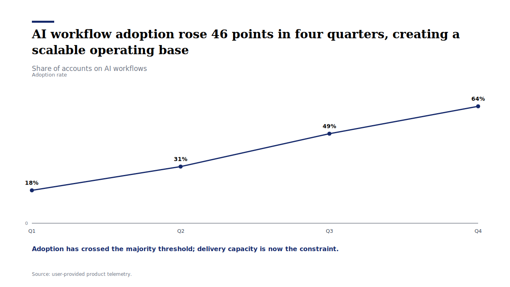 |

Supported render patterns: `waterfall`, `gap`, `before_after`, `time_series`, `benchmark_table`, `summary_strip`, `process_flow`, `funnel`, `heatmap`, `gantt`, `kpi_scorecard`, `two_by_two`. Other patterns ship as slide specs and image-generation prompts.

## Share Your Output

If this helps you turn rough notes into a useful slide, star the repo so you can find it again and share the result in [GitHub Discussions](https://github.com/kgraph57/mckinsey-style-visualization-skill/discussions). Good community examples are the fastest way to improve the pattern library.

Useful contributions:

- A messy input and the rendered SVG or slide spec it produced.
- A business scenario that needs a clearer visual pattern.
- A broken, confusing, or overconfident output that should become a regression test.

For requests, use the [Example request issue template](https://github.com/kgraph57/mckinsey-style-visualization-skill/issues/new?template=example_request.md).

## By Role

The [persona playbook](references/persona-playbook.md) gives every role a copy-paste prompt and a rendered example:

| Role | Ask For | Rendered Example |
| --- | --- | --- |
| Sales | Pipeline QBR, proposal visuals | 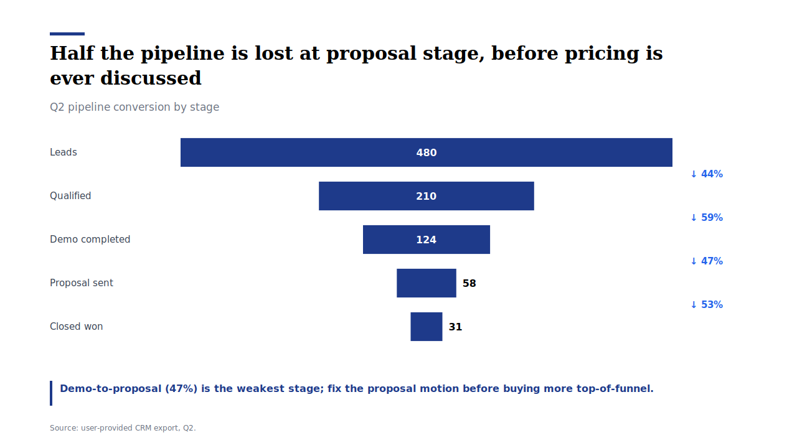 |
| Project manager / PMO | Roadmap with critical path | 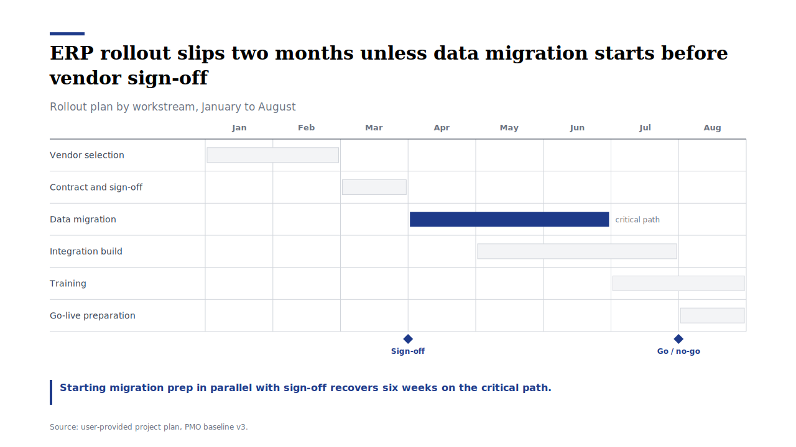 |
| Marketing | Channel x segment performance | 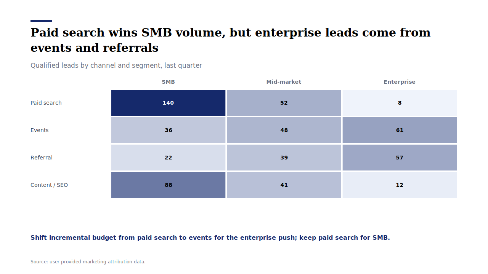 |
| HR / People ops | Talent scorecard | 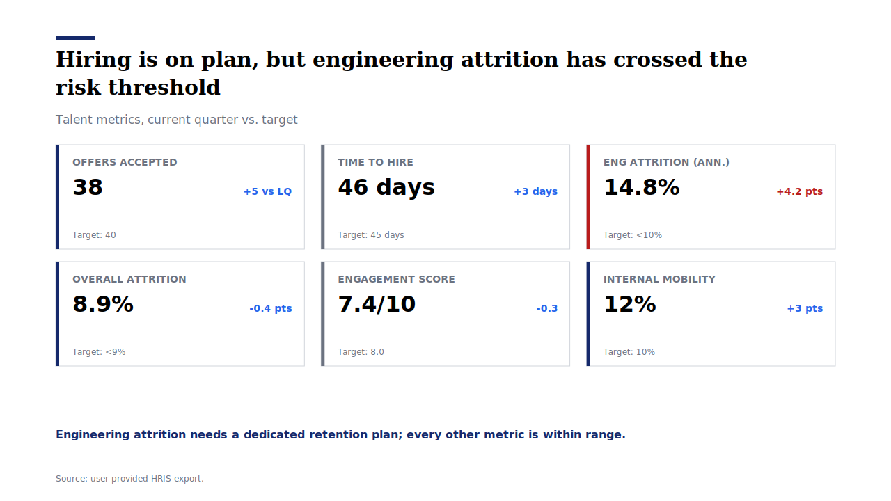 |
| Product manager | Effort vs. impact prioritization | 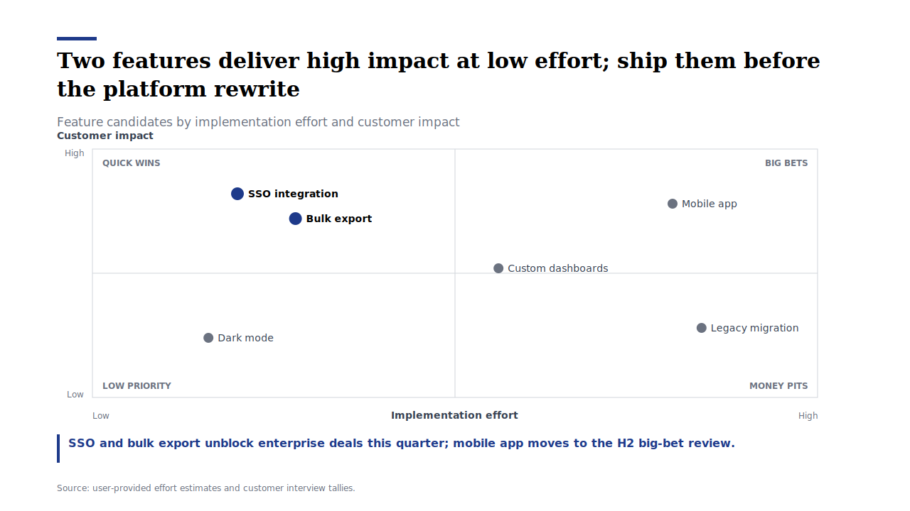 |
| Engineer / Tech lead | Incident postmortem flow | 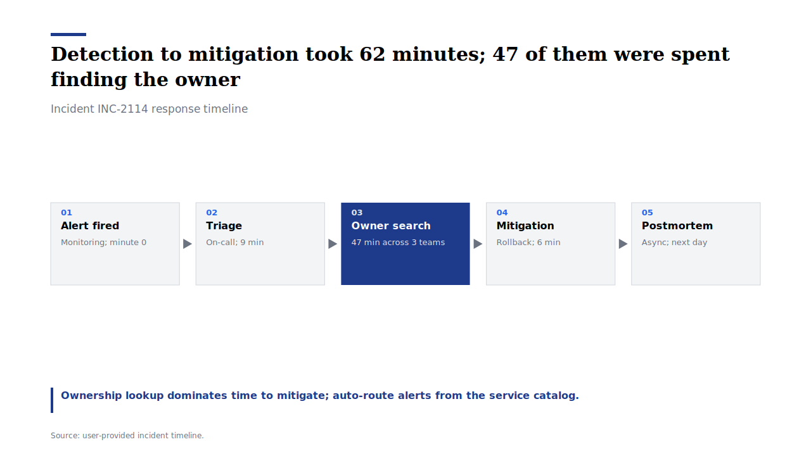 |
| Researcher / Clinician | Study outcome summary | 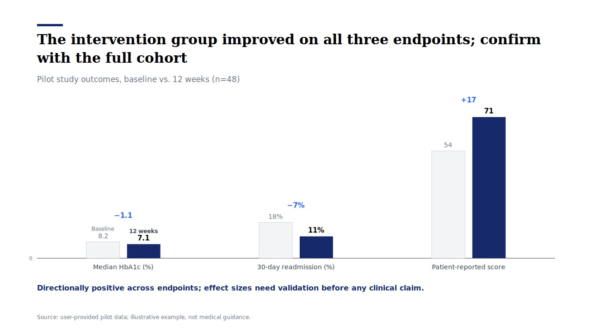 |

Finance and executive examples live in the gallery above. Japanese business formats (稟議書, 週報, 学会抄録, 提案書) have dedicated profiles in [document-type-profiles.md](references/document-type-profiles.md).

## What You Can Do

Use this skill when you have messy business notes, metrics, or a strategic question and need a slide-ready consulting visualization direction.

| Starting Point | Ask For | You Get |
| --- | --- | --- |
| Board update metrics | Executive board update story | 5 slide specs: cover, revenue waterfall, adoption trend, capacity gap, recommendation |
| Revenue bridge data | Waterfall chart | Start value, drivers, end value, labels, assumptions, and visual hierarchy |
| Competitor or vendor data | Competitive benchmark | Ranked table, 2x2 positioning map, leader highlights, caveats |
| Market entry notes | Market analysis visual | country contrast, opportunity gap, timeline, investment comparison |
| Product milestones | Strategy timeline | milestone nodes, decision gates, rollout sequence, risk annotations |
| KPI before/after data | Impact slide | before/after comparison, delta labels, implication headline |
| Raw deck outline | Executive summary strip | 3-5 decision-ready takeaways with proof points and implications |
| Process description or SOP | Process flow or decision tree | Steps, owners, decision gates, and the bottleneck to fix |
| Research notes or whitepaper draft | Report figure plan | Numbered figures with sources, distributions, and methodology flow |
| Lesson or tutorial content | Training visual sequence | One-concept-per-visual flow, concept maps, before/after examples |
| Any prose, notes, or messy input | "Visualize this" | Input triage to the right pattern, document profile, and visual spec |

### Beyond Board Slides

Since v1.6.0 the skill generalizes to **any document type and any input**:

- **Document profiles** ([document-type-profiles.md](references/document-type-profiles.md)): board decks, internal reports, research whitepapers, sales proposals, project status updates, training materials, technical documentation, one-pagers, infographics, policy briefs, academic summaries, and personal study notes — each with its own canvas, density, and tone.
- **Input triage** ([input-triage.md](references/input-triage.md)): maps numbers, prose, processes, hierarchies, relationships, decision logic, and qualitative arguments to the right pattern family, even when the request is just "visualize this".
- **Universal patterns**: process flows, funnels, cycles, hierarchies, pyramids, concept maps, Gantt/roadmaps, heatmaps, scatter plots, distributions, stacked compositions, KPI scorecards, decision trees, Sankey-style flows, maturity grids, and annotated maps.
- **Multiple canvases**: 16:9 slides, A4 report figures, vertical infographics, square cards, and inline diagram-as-code (Mermaid) figures.

The skill creates **slide specs, image-generation prompts, and rendered SVG slides** (via `scripts/render_slide_spec.py` for 12 patterns). The value is in turning business input into a reproducible visual plan that an agent, designer, or renderer can execute.

## Output Previews

These previews show the kind of artifact the skill helps an agent plan. They are lightweight README visuals, not final PowerPoint exports.

| Board Update Story | Visual Pattern Selection | Slide Spec Output |
| --- | --- | --- |
|  |  |  |

## Example Gallery

The skill can plan many kinds of board-ready strategy visuals. These examples show the visual direction a generated slide spec can describe.

| ARR Waterfall | Competitive Benchmark |
| --- | --- |
|  |  |

| 2x2 Market Map | Strategic Timeline |
| --- | --- |
|  |  |

| Capacity Gap | Before / After Impact |
| --- | --- |
|  |  |

| Market Adoption | Executive Summary Strip |
| --- | --- |
|  |  |

| Market Entry Comparison |
| --- |
|  |

## One-Minute Example

Give the skill this:

```text
ARR grew from $10M to $15M.
Enterprise expansion contributed $3M.
Existing customer expansion contributed $2.5M.
Churn reduced ARR by $0.5M.
AI workflow adoption grew from 18% to 64%.
The board needs to decide whether to invest in implementation capacity.
```

It returns this kind of output:

```text
Strategic question:
Should the board approve implementation capacity investment before raising enterprise targets?

Insight headline:
Growth momentum is strong, but implementation capacity is now the constraint on enterprise expansion.

Recommended visualization:
Five-slide board update: cover, ARR waterfall, AI adoption trend, capacity gap, executive recommendation.

Slide spec example:
Revenue Waterfall
- Start: Q1 ARR $10.0M
- Driver: +$3.0M enterprise new customers
- Driver: +$2.5M existing customer expansion
- Driver: -$0.5M churn
- End: Q4 ARR $15.0M
- Annotation: Net +$5.0M ARR; growth engine is enterprise-led.

Quality check:
Values reconcile, assumptions are explicit, and the recommendation is tied to the board decision.
```

## Iterative Review Loop

For polished executive materials, the package now includes a repeatable review loop:

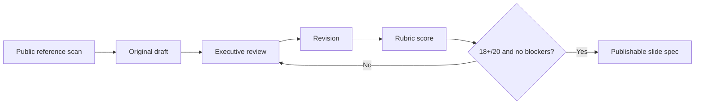

Use these files to run the loop:

- [Public reference corpus](references/public-reference-corpus.md)
- [Iterative review loop](references/iterative-review-loop.md)

Example loops:

| Scenario | Draft v1 | Review v1 | Draft v2 | Review v2 |
| --- | --- | --- | --- | --- |
| Board update | [draft](examples/review-loop/board-update-draft-v1.md) | [review](examples/review-loop/board-update-review-v1.md) | [draft](examples/review-loop/board-update-draft-v2.md) | [review](examples/review-loop/board-update-review-v2.md) |
| Vendor selection | [draft](examples/review-loop/vendor-selection-draft-v1.md) | [review](examples/review-loop/vendor-selection-review-v1.md) | [draft](examples/review-loop/vendor-selection-draft-v2.md) | [review](examples/review-loop/vendor-selection-review-v2.md) |
| Investment memo | [draft](examples/review-loop/investment-memo-draft-v1.md) | [review](examples/review-loop/investment-memo-review-v1.md) | [draft](examples/review-loop/investment-memo-draft-v2.md) | [review](examples/review-loop/investment-memo-review-v2.md) |
| Market entry | [draft](examples/review-loop/market-entry-draft-v1.md) | [review](examples/review-loop/market-entry-review-v1.md) | [draft](examples/review-loop/market-entry-draft-v2.md) | [review](examples/review-loop/market-entry-review-v2.md) |

You can also run a lightweight structural review:

```bash
python3 scripts/review_slide_spec.py examples/review-loop/market-entry-draft-v2.md
```

## At a Glance

This skill turns raw business input into a board-ready visualization spec. It is structured as a portable `SKILL.md` package with references, proof examples, marketplace metadata, and local validation.

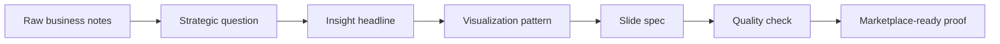

| Layer | What It Does | File |
| --- | --- | --- |
| Skill entrypoint | Tells agents when and how to use the skill | [SKILL.md](SKILL.md) |
| Input triage | Maps any input to a pattern family | [input-triage.md](references/input-triage.md) |
| Document profiles | Adapts format and tone per deliverable | [document-type-profiles.md](references/document-type-profiles.md) |
| Pattern library | Selects the right executive visual | [visualization-patterns.md](references/visualization-patterns.md) |
| Style system | Defines palette, typography, layout, and chart rules | [style-system.md](references/style-system.md) |
| Prompt templates | Converts decisions and data into reproducible specs | [prompt-templates.md](references/prompt-templates.md) |
| Quality rubric | Scores strategy, data, hierarchy, portability, and safety | [quality-rubric.md](references/quality-rubric.md) |
| Expert review loop | Challenges assumptions, overclaims, reader fit, accessibility, and localization | [expert-review-loop.md](references/expert-review-loop.md) |
| Renderer | Turns spec JSON into styled SVG slides | [render_slide_spec.py](scripts/render_slide_spec.py) |
| Proof pack | Shows input, expected output, and evaluation | [examples/](examples) |
| Marketplace layer | Provides listing copy and metadata | [MARKETPLACE.md](MARKETPLACE.md) / [manifest.json](marketplace/manifest.json) |
| Validation | Checks package structure before publishing | [validate_skill.py](scripts/validate_skill.py) |

## Why This Exists

Most AI-generated business charts become generic dashboards or decorative slide art. This skill gives agents a stricter operating system for strategy-consulting visualization:

- insight-led headlines instead of descriptive titles
- pattern selection tied to executive decisions
- disciplined visual hierarchy, palette, typography, and density
- explicit data assumptions and source-sensitive caveats
- reusable slide specs that can be rendered by designers, agents, or presentation tools

## What It Produces

The skill returns a structured deliverable:

```text
Strategic question
Insight headline
Recommended visualization
Slide spec
Data and assumptions
Quality check
```

The output is meant to be useful before rendering. A consultant, designer, agent, or slide-generation tool should be able to use the spec without reverse-engineering the intent.

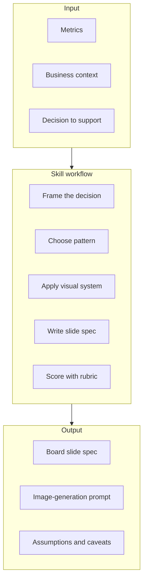

## Visualization Patterns

Core strategy patterns:

| Pattern | Best For | Example Decision |
| --- | --- | --- |
| Time-series growth | Momentum, adoption, revenue, usage | Is growth accelerating? |
| Gap visualization | Current vs. target, leader vs. laggard | How large is the execution gap? |
| Before-after comparison | Intervention impact | Did the program justify investment? |
| Market share / adoption | Penetration and composition | Where is the center of gravity? |
| Investment / scale infographic | Capacity, spend, reach, operating scale | Who has the scale advantage? |
| Timeline | Rollouts, regulation, milestones | What must happen by when? |
| Contrast diagram | Region, strategy, or model comparison | Where is the structural difference? |
| 2x2 strategic framework | Positioning options or competitors | Which position is attractive? |
| Competitive benchmark table | Multi-criteria vendor or competitor review | Who leads on what matters? |
| Waterfall chart | Bridge, variance, cumulative change | What drove the delta? |
| Cover slide | Deck or section opening | What is the argument? |
| Executive summary strip | Compact board memo takeaway | What should leaders remember? |

Universal patterns for any document:

| Pattern | Best For | Example Question |
| --- | --- | --- |
| Process flow | Workflows, SOPs, pipelines | What happens, in what order? |
| Funnel | Conversion, attrition, staged loss | Where do we lose the most? |
| Cycle diagram | Loops, feedback systems, habits | What sustains this loop? |
| Hierarchy / tree | Org charts, taxonomies, breakdowns | How is this organized? |
| Pyramid | Layered arguments, priorities, maturity | What is the foundation? |
| Concept / system map | Relationships, architectures, dependencies | How do the parts interact? |
| Gantt / roadmap | Workstreams, phases, dependencies | Are we on track? |
| Heatmap matrix | Intensity across two dimensions | Where are the hot spots? |
| Scatter / correlation | Two continuous variables | Do these move together? |
| Distribution chart | Spread, concentration, outliers | What is typical, what is extreme? |
| Stacked composition | Mix shifts across items or time | How is the mix changing? |
| KPI scorecard | Many metrics at a glance | What needs attention? |
| Decision tree | Branching logic, eligibility, escalation | Given my case, what do I do? |
| Flow / allocation | Quantity splits between stages | Where does the volume go? |
| Checklist / maturity grid | Completion or capability levels | What is the next level? |
| Annotated map | Geographic concentration | Where is this happening? |

## Install

### Personal Skill

```bash
git clone https://github.com/kgraph57/mckinsey-style-visualization-skill.git ~/.claude/skills/strategy-consulting-visualization
```

### Project Skill

```bash
git clone https://github.com/kgraph57/mckinsey-style-visualization-skill.git .claude/skills/strategy-consulting-visualization
```

### Direct Download

```bash
mkdir -p ~/.claude/skills/strategy-consulting-visualization
curl -o ~/.claude/skills/strategy-consulting-visualization/SKILL.md https://raw.githubusercontent.com/kgraph57/mckinsey-style-visualization-skill/main/SKILL.md
```

Clone the full repository for marketplace-quality behavior. The entrypoint references files in `references/`.

## Validate

Run the local package check before publishing, listing, or submitting changes:

```bash
python3 -m unittest discover -s tests
python3 scripts/validate_skill.py
```

Expected output:

```text
OK: skill package passed validation
```

The validator checks the marketplace-critical pieces:

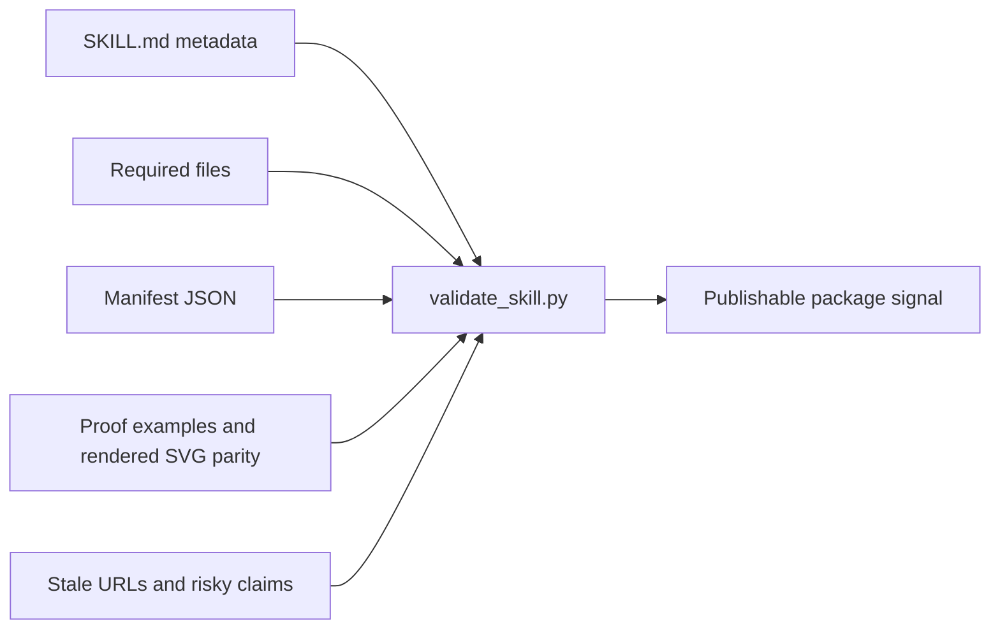

## Example Prompt

```text
Use the strategy consulting visualization skill to turn this board update into five slide specs:
- ARR grew from $10M to $15M over four quarters.
- Enterprise expansion contributed $3M.
- Churn reduced revenue by $0.5M.
- AI workflow adoption grew from 18% to 64%.
- Forecast risk is concentrated in implementation capacity.
```

See the proof set:

- [Board update input](examples/board-update-input.md)
- [Expected slide spec](examples/board-update-slide-spec.md)
- [Evaluation report](examples/evaluation-report.md)

## Proof Flow

The proof pack shows how a future marketplace reviewer or buyer can inspect the asset quickly.

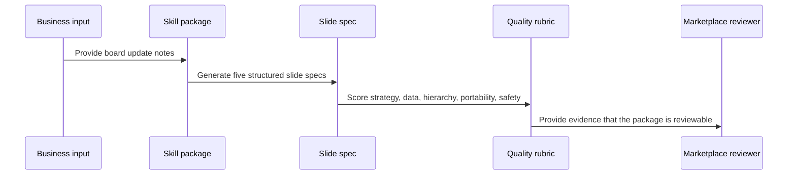

## Repository Map

```text
.
├── SKILL.md
├── references/
│   ├── input-triage.md
│   ├── document-type-profiles.md
│   ├── style-system.md
│   ├── visualization-patterns.md
│   ├── prompt-templates.md
│   └── quality-rubric.md
├── examples/
│   ├── board-update-input.md
│   ├── board-update-slide-spec.md
│   └── evaluation-report.md
├── marketplace/
│   └── manifest.json
├── assets/
│   ├── readme/
│   └── social/
├── .github/
│   ├── ISSUE_TEMPLATE/
│   └── PULL_REQUEST_TEMPLATE.md
├── scripts/
│   ├── render_slide_spec.py
│   ├── review_slide_spec.py
│   └── validate_skill.py
├── MARKETPLACE.md
├── MARKETPLACE_TARGETS.md
├── LAUNCH.md
├── BUYER_BRIEF.md
├── TRACTION.md
├── SECURITY.md
├── CHANGELOG.md
└── ROADMAP.md
```

## Marketplace Readiness

| Readiness Area | Status | Evidence |
| --- | --- | --- |
| Portable entrypoint | Ready | [SKILL.md](SKILL.md) |
| Progressive loading | Ready | [references/](references) |
| Proof examples | Ready | [examples/](examples) |
| Local validation | Ready | [validate_skill.py](scripts/validate_skill.py) |
| Marketplace metadata | Ready | [manifest.json](marketplace/manifest.json) |
| Storefront copy | Ready | [MARKETPLACE.md](MARKETPLACE.md) |
| Launch copy | Ready | [LAUNCH.md](LAUNCH.md) |
| Listing targets | Ready | [MARKETPLACE_TARGETS.md](MARKETPLACE_TARGETS.md) |
| Buyer diligence | Ready | [BUYER_BRIEF.md](BUYER_BRIEF.md) |
| Traction tracking | Ready | [TRACTION.md](TRACTION.md) |
| Inquiry intake | Ready | [.github/ISSUE_TEMPLATE](.github/ISSUE_TEMPLATE) |
| Security posture | Ready | [SECURITY.md](SECURITY.md) |
| Product roadmap | Ready | [ROADMAP.md](ROADMAP.md) |
| Release history | Ready | [CHANGELOG.md](CHANGELOG.md) |

## Commercial Angle

This package is designed to become:

- a listed skill in future agent-skill marketplaces
- a premium template pack for executive visualization workflows
- a proof library for agents that create board-ready slide specs
- a foundation for later renderer or SaaS integration

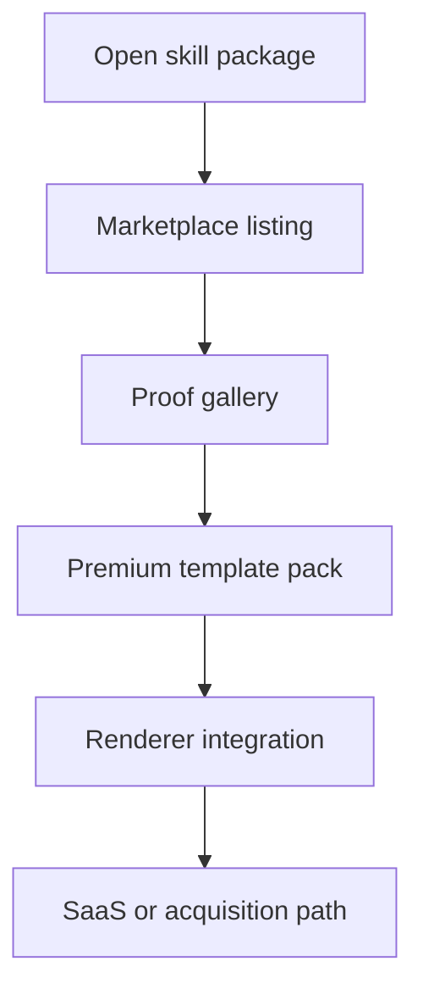

## Disclaimer

This is an independent skill package. It is not affiliated with, endorsed by, or sponsored by McKinsey & Company, Boston Consulting Group, Bain & Company, or any other consulting firm. Named firms may appear only as common style references or search terms.

## License

MIT. See [LICENSE](LICENSE).
