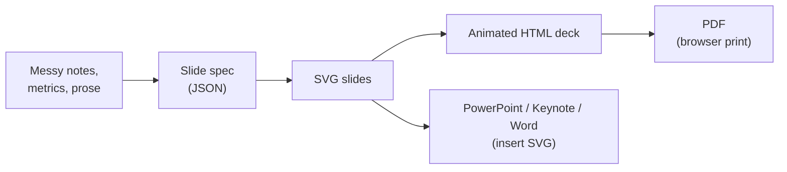
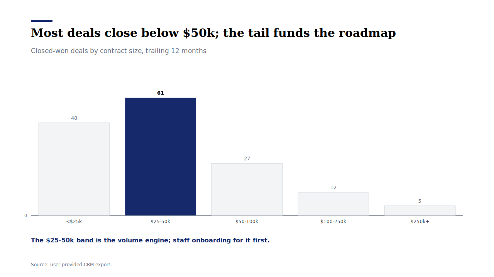

<div align="center">

# Strategy Consulting Visualization Skill

**Messy notes in. Board-ready slides out.**

One skill for your AI agent: turn notes, metrics, and prose into consulting-grade visuals — as real SVG slides, as an **animated HTML deck**, or as a spec any designer or tool can execute.

Python 3 standard library only. **Zero dependencies. Zero API keys. Zero network calls.**

[](LICENSE)
[](https://github.com/kgraph57/mckinsey-style-visualization-skill/actions/workflows/ci.yml)
[](SKILL.md)
[](https://github.com/kgraph57/mckinsey-style-visualization-skill/releases/tag/v1.9.0)

English | [日本語](README.ja.md)


*An actual deck built by this repo: `specs (JSON) → SVG slides → animated HTML deck`. Nothing hand-drawn.*

</div>

## Why This Gets Starred

- **It actually renders.** 16 chart patterns produce real SVG slides — waterfall, executive summary, 2×2, scatter, heatmap, Gantt, small multiples, cover, and more. Every gallery image below is committed renderer output, verified fresh by CI on every push.
- **Animated HTML decks from one command.** Combine slides into a single self-contained HTML file: quiet staggered reveals, keyboard navigation, progress bar, zero external requests. Press `p` → your browser prints it → **you have a PDF**.
- **Works with your slide tools.** The SVGs drop straight into **PowerPoint, Keynote, and Word** (Insert → Picture). For Google Slides, export PNG from any browser first.
- **Japanese business documents are first-class.** CJK text wraps correctly (measured per fullwidth character, not by spaces), fonts fall back to Noto Sans JP / Hiragino, and there are dedicated profiles for 稟議書, 役員会資料, 週報, 学会抄録.
- **Charts that survive an audit.** Bar proportions match the data (Lie Factor ≈ 1.0), zero baselines are marked, cell text passes WCAG AA contrast across the whole color ramp, and the accent navy stays readable in greyscale print — all of it **asserted in the test suite**, not promised in prose.
- **Roasted by five design legends, then fixed.** We ran the whole system through a five-perspective design panel — Tufte's data-ink discipline, an ex-McKinsey chart master, Swiss grid typography, FT-style data journalism, and modern design engineering. They scored it 5.8/10 and listed every flaw. v1.9.0 shipped every fix. [Read the receipts.](#roasted-by-five-design-legends)

## 60-Second Start

```bash
# 1. Get it (this is also how you install it as an agent skill)
git clone https://github.com/kgraph57/mckinsey-style-visualization-skill.git ~/.claude/skills/strategy-consulting-visualization
cd ~/.claude/skills/strategy-consulting-visualization

# 2. Render one slide → SVG
python3 scripts/render_slide_spec.py examples/render-specs/arr-waterfall.json -o slide.svg

# 3. Build the full animated deck → one HTML file
python3 scripts/build_html_deck.py --manifest examples/demo-deck.json -o deck.html
open deck.html   # ← arrows to navigate, "p" to print → PDF
```

Or skip the terminal and just ask your agent:

```text
Use the strategy consulting visualization skill to turn these notes into a board slide:
ARR grew from $10M to $15M. Enterprise added $3M, expansion $2.5M, churn -$0.5M.
The board must decide on implementation capacity investment.
```

## The Pipeline



Specs are plain JSON, so they diff, review, and version like code. The renderer and deck builder are single-file Python scripts with no installs.

## Gallery

Every image is committed output of `scripts/render_slide_spec.py` — CI fails if any of them drifts from what the renderer actually produces. Specs live in [examples/render-specs/](examples/render-specs).

| ARR Waterfall | Executive Summary Strip |
| --- | --- |
|  |  |

| Small Multiples | Scatter / Correlation |
| --- | --- |
|  |  |

| Japanese Board Summary（役員会サマリー） | Cover Slide |
| --- | --- |
|  |  |

| Benchmark Table | Distribution |
| --- | --- |
|  |  |

| Capacity Gap | Process Flow |
| --- | --- |
|  |  |

**16 patterns render to SVG**: `cover`, `waterfall`, `gap`, `before_after`, `time_series`, `benchmark_table`, `summary_strip`, `process_flow`, `funnel`, `heatmap`, `gantt`, `kpi_scorecard`, `two_by_two`, `scatter`, `distribution`, `small_multiples`. Twelve more patterns (Sankey, pyramid, maps, decision trees, …) ship as structured specs and image-generation prompts — [the catalog says exactly which is which](references/visualization-patterns.md). We don't pretend.

## Animated HTML Decks

```bash
python3 scripts/build_html_deck.py cover.json bridge.json summary.json -o deck.html --title "Q4 Review"
```

One command, one file, and you get:

- **Quiet, staggered element reveals** on every slide — the restrained kind, not slide-carnival transitions (`prefers-reduced-motion` respected)
- **Keyboard + click navigation**, progress bar, slide counter, deep links (`deck.html#3`)
- **Print stylesheet**: `p` or Cmd+P gives you one slide per page → save as **PDF**
- **Zero external requests** — fonts, styles, scripts, and SVGs are all inline. Email it, host it, present offline.

Try the committed demo: [examples/demo-deck.html](examples/demo-deck.html) (open locally after cloning).

## Export Anywhere

| Target | How | Fidelity |
| --- | --- | --- |
| PDF | Open the HTML deck → print → save as PDF | Vector, one slide per page |
| PowerPoint / Keynote / Word | Insert the SVG files as pictures | Vector, scales losslessly |
| Google Slides / Docs | Render SVG → PNG in any browser, then insert | Raster at any resolution |
| Design tools (Figma, Illustrator) | Open the SVG directly | Fully editable vectors |
| Docs / wikis / GitHub | Embed the SVG — GitHub renders it inline | What you see in this README |

## Roasted by Five Design Legends

Most chart generators say "beautiful". We wanted **defensible**, so we convened a five-perspective design review panel (as rigorous AI personas) and told them to be merciless:

| Reviewer lens | Verdict | Sharpest cut |
| --- | --- | --- |
| Edward Tufte — data-ink, honest scales | 5.5/10 | "Meaningless decorated rectangles baked into the renderer" |
| Gene Zelazny — ex-McKinsey, *Say It With Charts* | 6.5/10 | "The flagship example violates its own headline rule" |
| Vignelli × Müller-Brockmann — Swiss grid | 6/10 | "A corporate template, not a design system" |
| Alan Smith — FT data journalism | 5.5/10 | "The waterfall draws off-canvas on negative bridges" (he proved it) |
| Modern design engineering | 5.5/10 | "2016 visuals wearing a 2020s spec sheet" |

Then we shipped **every fix** in [v1.9.0](CHANGELOG.md): zero-floor waterfalls, CJK-correct wrapping, no silent truncation, a single re-derived navy that survives greyscale printing, diverging heatmaps for signed data, WCAG-AA cell text asserted across the entire ramp, decoration stripped, a comparison-type gate before every chart choice, and a rubric that now measures data-ink integrity and deck-level storyline logic.

The result is a visual system you can defend in front of a board, an auditor, or a design critic — because it already survived one.

## The Discipline Under the Hood

The renderer is the visible part. The skill underneath is a full operating system for executive visualization:

- **Message first**: every visual starts from the reader's decision, gets a single-proposition insight headline, and only then picks a chart — gated by the five comparison types (component / item / time series / distribution / correlation).
- **A real style system**: [design tokens on an 8px grid, a fixed type scale, one navy, an emphasis ladder (fill > line > text) with hard caps](references/style-system.md) — the same constants the renderer executes.
- **A quality rubric with teeth**: [24-point scoring](references/quality-rubric.md) across strategy, data integrity, data-ink honesty, hierarchy, portability, and safety, plus blocking gates (no color-only meaning, no invented data, no implied rendering that doesn't exist).
- **An adversarial review loop**: [expert lenses](references/expert-review-loop.md) that hunt overclaims, insider jargon, accessibility failures, and cultural assumptions before anything is called publishable.

## By Role

The [persona playbook](references/persona-playbook.md) gives every role a copy-paste prompt and a rendered example:

| Role | Ask For | Rendered Example |
| --- | --- | --- |
| Sales | Pipeline QBR, proposal visuals |  |
| Project manager / PMO | Roadmap with critical path |  |
| Marketing | Channel × segment performance |  |
| HR / People ops | Talent scorecard |  |
| Product manager | Effort vs. impact prioritization |  |
| Engineer / Tech lead | Incident postmortem flow |  |
| Researcher / Clinician | Study outcome summary |  |

Japanese business formats (稟議書, 週報・月報, 役員会資料, 学会抄録, 提案書) have dedicated profiles in [document-type-profiles.md](references/document-type-profiles.md).

## One-Minute Example

Give the skill this:

```text
ARR grew from $10M to $15M.
Enterprise expansion contributed $3M. Existing customers added $2.5M. Churn cost $0.5M.
AI workflow adoption grew from 18% to 64%.
The board needs to decide whether to invest in implementation capacity.
```

It returns a decision-framed spec — strategic question, single-proposition headline, pattern choice with reasoning, exact values and labels, assumptions, and a rubric score — that renders to the waterfall you saw in the gallery. See the full worked proof: [input](examples/board-update-input.md) → [slide specs](examples/board-update-slide-spec.md) → [evaluation](examples/evaluation-report.md).

## What You Can Point It At

| Starting Point | You Get |
| --- | --- |
| Board update metrics | 5-slide story: cover, waterfall, trend, gap, recommendation |
| Revenue bridge data | Waterfall with drivers, honest baselines, assumptions |
| Competitor / vendor data | Benchmark table + 2×2 positioning with leader highlights |
| KPI before/after data | Impact slide with deltas and an implication headline |
| Process description / SOP | Process flow with owners and the bottleneck highlighted |
| Segment metrics over time | Small-multiples grid on one honest shared scale |
| Research notes / whitepaper | Numbered report figures with sources and distributions |
| Any prose — "visualize this" | Input triage → right pattern → document profile → spec |

## Install

```bash
# Personal skill (Claude Code)
git clone https://github.com/kgraph57/mckinsey-style-visualization-skill.git ~/.claude/skills/strategy-consulting-visualization

# Project skill
git clone https://github.com/kgraph57/mckinsey-style-visualization-skill.git .claude/skills/strategy-consulting-visualization
```

Verify the package (same checks CI runs):

```bash
python3 -m unittest discover -s tests
python3 scripts/validate_skill.py   # → OK: skill package passed validation
```

The validator re-renders every committed SVG and the demo deck from source specs and fails on any drift — the gallery cannot silently rot.

## Star It, Break It, Share It

If this turned your rough notes into a usable slide, **star the repo** — stars are how other people find tools that actually render instead of hallucinate.

Even better contributions:

- A messy input and the slide it produced ([Discussions](https://github.com/kgraph57/mckinsey-style-visualization-skill/discussions))
- A business scenario that needs a pattern we don't have ([request template](https://github.com/kgraph57/mckinsey-style-visualization-skill/issues/new?template=example_request.md))
- An output that's broken, confusing, or overconfident — it becomes a regression test

[](https://star-history.com/#kgraph57/mckinsey-style-visualization-skill&Date)

<details>
<summary><strong>Repository map & package internals</strong></summary>

| Layer | What It Does | File |
| --- | --- | --- |
| Skill entrypoint | Tells agents when and how to use the skill | [SKILL.md](SKILL.md) |
| Input triage | Maps any input to a pattern family | [input-triage.md](references/input-triage.md) |
| Document profiles | Adapts format and tone per deliverable | [document-type-profiles.md](references/document-type-profiles.md) |
| Pattern library | Comparison-type gate + 28-pattern catalog | [visualization-patterns.md](references/visualization-patterns.md) |
| Style system | Tokens, palette, typography, chart rules | [style-system.md](references/style-system.md) |
| Prompt templates | Reproducible spec formats | [prompt-templates.md](references/prompt-templates.md) |
| Quality rubric | 24-point scoring + blocking gates + deck check | [quality-rubric.md](references/quality-rubric.md) |
| Expert review loop | Adversarial pre-publication review | [expert-review-loop.md](references/expert-review-loop.md) |
| SVG renderer | Spec JSON → styled SVG slide | [render_slide_spec.py](scripts/render_slide_spec.py) |
| Deck builder | SVG slides → animated single-file HTML deck | [build_html_deck.py](scripts/build_html_deck.py) |
| Structural review | Lint a drafted spec document | [review_slide_spec.py](scripts/review_slide_spec.py) |
| Validation | Package integrity + render parity | [validate_skill.py](scripts/validate_skill.py) |

Iterative review-loop examples (draft → review → revision, four scenarios) live in [examples/review-loop/](examples/review-loop). Distribution and commercial docs: [MARKETPLACE.md](MARKETPLACE.md), [BUYER_BRIEF.md](BUYER_BRIEF.md), [ROADMAP.md](ROADMAP.md), [SECURITY.md](SECURITY.md), [CHANGELOG.md](CHANGELOG.md).

</details>

## Disclaimer

This is an independent skill package. It is not affiliated with, endorsed by, or sponsored by McKinsey & Company, Boston Consulting Group, Bain & Company, or any other consulting firm. Named firms may appear only as common style references or search terms.

## License

MIT. See [LICENSE](LICENSE).
