# Strategy Consulting Visualization Skill

> Marketplace-ready Agent Skill for executive strategy visualizations, board slides, competitive benchmarks, investment memos, market maps, timelines, waterfall charts, and data-backed slide specifications.

[](LICENSE)
[](SKILL.md)
[](scripts/validate_skill.py)
[](https://github.com/kgraph57/mckinsey-style-visualization-skill/releases/tag/v1.2.0)

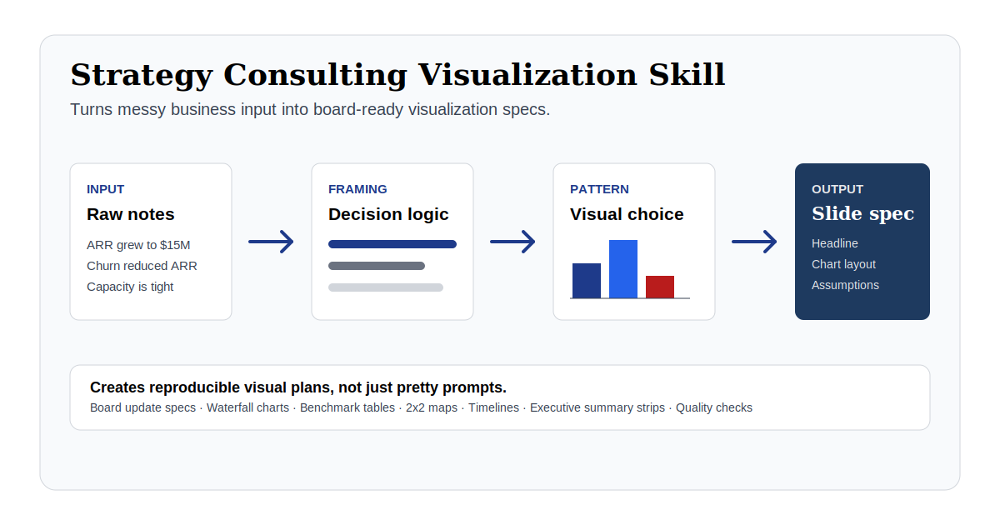

## What You Can Do

Use this skill when you have messy business notes, metrics, or a strategic question and need a slide-ready consulting visualization direction.

| Starting Point | Ask For | You Get |
| --- | --- | --- |
| Board update metrics | Executive board update story | 5 slide specs: cover, revenue waterfall, adoption trend, capacity gap, recommendation |
| Revenue bridge data | Waterfall chart | Start value, drivers, end value, labels, assumptions, and visual hierarchy |
| Competitor or vendor data | Competitive benchmark | Ranked table, 2x2 positioning map, leader highlights, caveats |
| Market entry notes | Market analysis visual | country contrast, opportunity gap, timeline, investment comparison |
| Product milestones | Strategy timeline | milestone nodes, decision gates, rollout sequence, risk annotations |
| KPI before/after data | Impact slide | before/after comparison, delta labels, implication headline |
| Raw deck outline | Executive summary strip | 3-5 decision-ready takeaways with proof points and implications |

The skill mainly creates **slide specs and image-generation prompts**. It does not render final PowerPoint slides by itself. The value is in turning business input into a reproducible visual plan that an agent, designer, or renderer can execute.

## Output Previews

These previews show the kind of artifact the skill helps an agent plan. They are lightweight README visuals, not final PowerPoint exports.

| Board Update Story | Visual Pattern Selection | Slide Spec Output |
| --- | --- | --- |
| 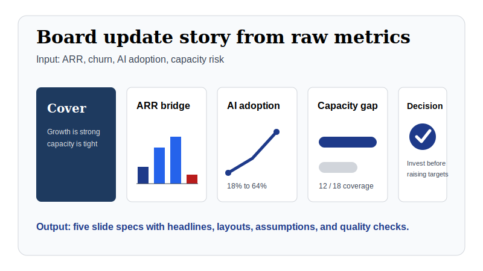 | 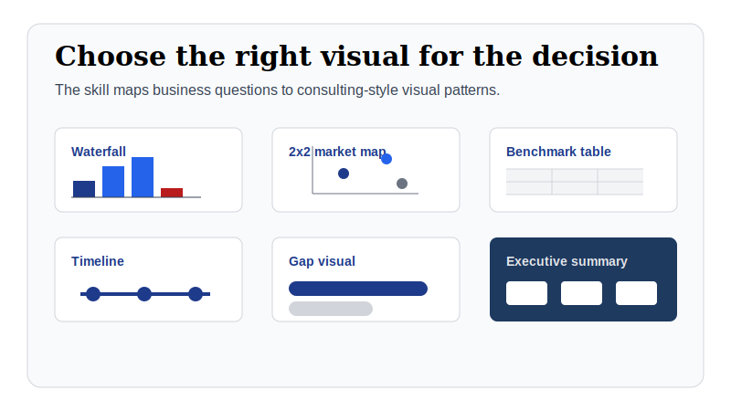 | 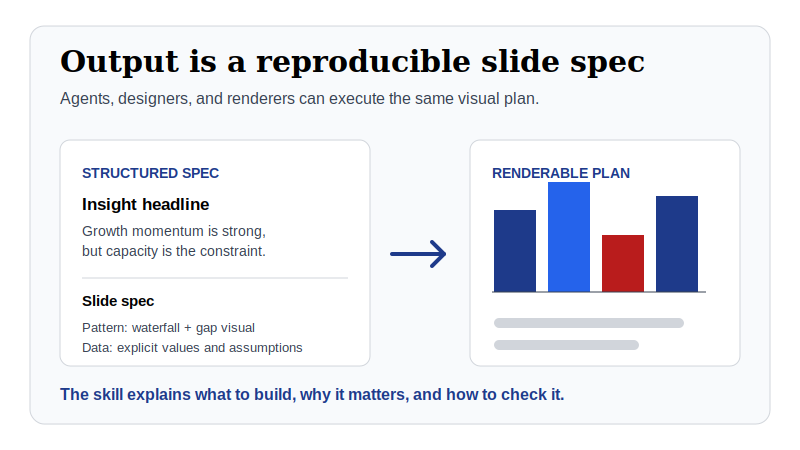 |

## Example Gallery

The skill can plan many kinds of board-ready strategy visuals. These examples show the visual direction a generated slide spec can describe.

| ARR Waterfall | Competitive Benchmark |
| --- | --- |
| 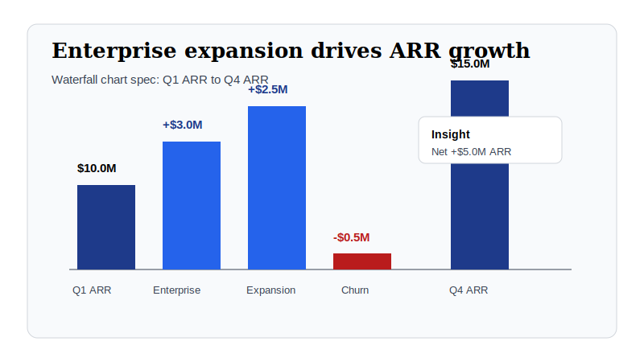 | 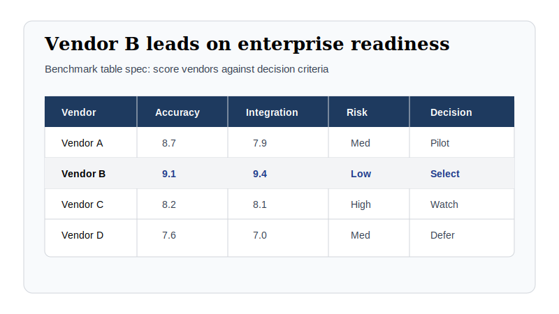 |

| 2x2 Market Map | Strategic Timeline |
| --- | --- |
| 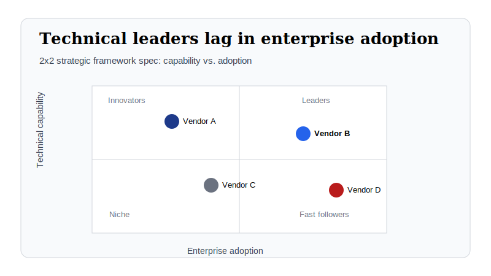 | 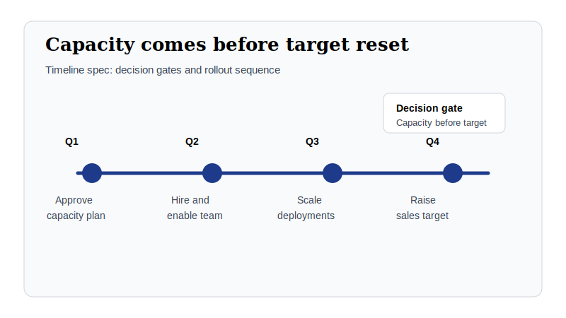 |

| Capacity Gap | Before / After Impact |
| --- | --- |
| 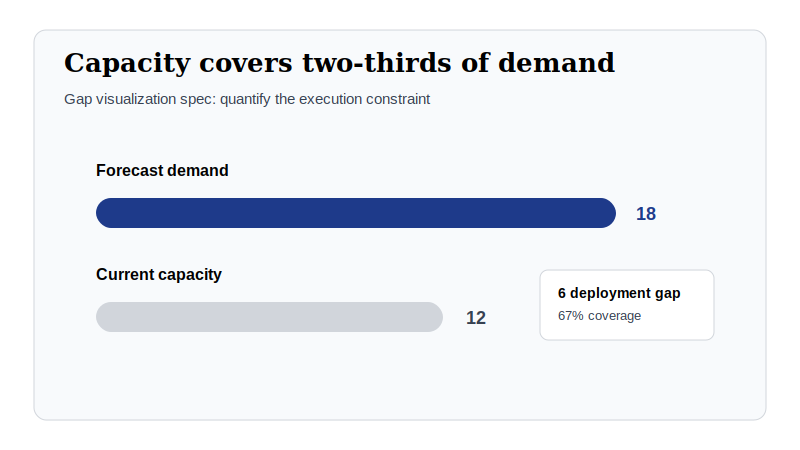 | 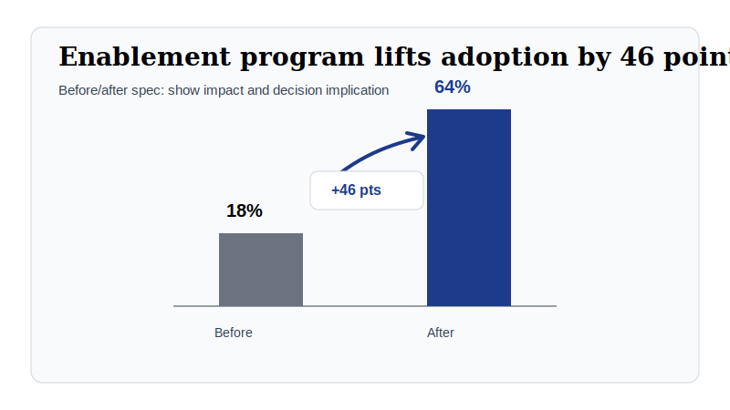 |

| Market Adoption | Executive Summary Strip |
| --- | --- |
| 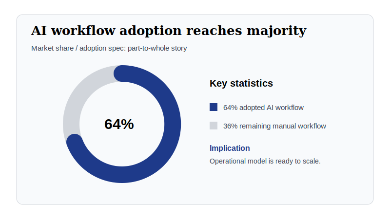 | 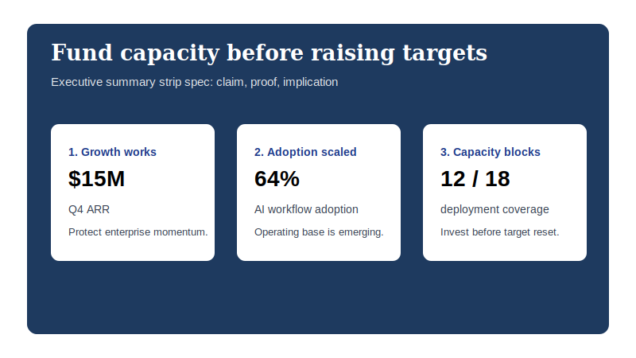 |

| Market Entry Comparison |
| --- |
| 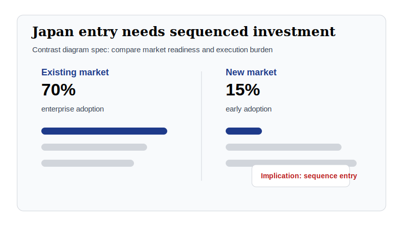 |

## One-Minute Example

Give the skill this:

```text
ARR grew from $10M to $15M.
Enterprise expansion contributed $3M.
Existing customer expansion contributed $2.5M.
Churn reduced ARR by $0.5M.
AI workflow adoption grew from 18% to 64%.
The board needs to decide whether to invest in implementation capacity.
```

It returns this kind of output:

```text
Strategic question:
Should the board approve implementation capacity investment before raising enterprise targets?

Insight headline:
Growth momentum is strong, but implementation capacity is now the constraint on enterprise expansion.

Recommended visualization:
Five-slide board update: cover, ARR waterfall, AI adoption trend, capacity gap, executive recommendation.

Slide spec example:
Revenue Waterfall
- Start: Q1 ARR $10.0M
- Driver: +$3.0M enterprise new customers
- Driver: +$2.5M existing customer expansion
- Driver: -$0.5M churn
- End: Q4 ARR $15.0M
- Annotation: Net +$5.0M ARR; growth engine is enterprise-led.

Quality check:
Values reconcile, assumptions are explicit, and the recommendation is tied to the board decision.
```

## Iterative Review Loop

For polished executive materials, the package now includes a repeatable review loop:

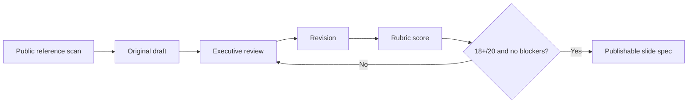

Use these files to run the loop:

- [Public reference corpus](references/public-reference-corpus.md)
- [Iterative review loop](references/iterative-review-loop.md)
- [Market entry draft v1](examples/review-loop/market-entry-draft-v1.md)
- [Review v1](examples/review-loop/market-entry-review-v1.md)
- [Market entry draft v2](examples/review-loop/market-entry-draft-v2.md)
- [Review v2](examples/review-loop/market-entry-review-v2.md)

You can also run a lightweight structural review:

```bash
python3 scripts/review_slide_spec.py examples/review-loop/market-entry-draft-v2.md
```

## At a Glance

This skill turns raw business input into a board-ready visualization spec. It is structured as a portable `SKILL.md` package with references, proof examples, marketplace metadata, and local validation.

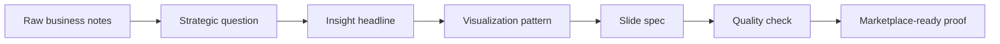

| Layer | What It Does | File |
| --- | --- | --- |
| Skill entrypoint | Tells agents when and how to use the skill | [SKILL.md](SKILL.md) |
| Pattern library | Selects the right executive visual | [visualization-patterns.md](references/visualization-patterns.md) |
| Style system | Defines palette, typography, layout, and chart rules | [style-system.md](references/style-system.md) |
| Prompt templates | Converts decisions and data into reproducible specs | [prompt-templates.md](references/prompt-templates.md) |
| Quality rubric | Scores strategy, data, hierarchy, portability, and safety | [quality-rubric.md](references/quality-rubric.md) |
| Proof pack | Shows input, expected output, and evaluation | [examples/](examples) |
| Marketplace layer | Provides listing copy and metadata | [MARKETPLACE.md](MARKETPLACE.md) / [manifest.json](marketplace/manifest.json) |
| Validation | Checks package structure before publishing | [validate_skill.py](scripts/validate_skill.py) |

## Why This Exists

Most AI-generated business charts become generic dashboards or decorative slide art. This skill gives agents a stricter operating system for strategy-consulting visualization:

- insight-led headlines instead of descriptive titles
- pattern selection tied to executive decisions
- disciplined visual hierarchy, palette, typography, and density
- explicit data assumptions and source-sensitive caveats
- reusable slide specs that can be rendered by designers, agents, or presentation tools

## What It Produces

The skill returns a structured deliverable:

```text
Strategic question
Insight headline
Recommended visualization
Slide spec
Data and assumptions
Quality check
```

The output is meant to be useful before rendering. A consultant, designer, agent, or slide-generation tool should be able to use the spec without reverse-engineering the intent.

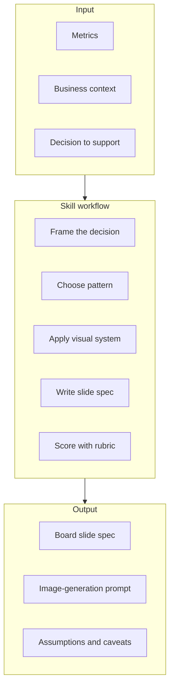

## Visualization Patterns

| Pattern | Best For | Example Decision |
| --- | --- | --- |
| Time-series growth | Momentum, adoption, revenue, usage | Is growth accelerating? |
| Gap visualization | Current vs. target, leader vs. laggard | How large is the execution gap? |
| Before-after comparison | Intervention impact | Did the program justify investment? |
| Market share / adoption | Penetration and composition | Where is the center of gravity? |
| Investment / scale infographic | Capacity, spend, reach, operating scale | Who has the scale advantage? |
| Timeline | Rollouts, regulation, milestones | What must happen by when? |
| Contrast diagram | Region, strategy, or model comparison | Where is the structural difference? |
| 2x2 strategic framework | Positioning options or competitors | Which position is attractive? |
| Competitive benchmark table | Multi-criteria vendor or competitor review | Who leads on what matters? |
| Waterfall chart | Bridge, variance, cumulative change | What drove the delta? |
| Cover slide | Deck or section opening | What is the argument? |
| Executive summary strip | Compact board memo takeaway | What should leaders remember? |

## Install

### Personal Skill

```bash
git clone https://github.com/kgraph57/mckinsey-style-visualization-skill.git ~/.claude/skills/strategy-consulting-visualization
```

### Project Skill

```bash
git clone https://github.com/kgraph57/mckinsey-style-visualization-skill.git .claude/skills/strategy-consulting-visualization
```

### Direct Download

```bash
mkdir -p ~/.claude/skills/strategy-consulting-visualization
curl -o ~/.claude/skills/strategy-consulting-visualization/SKILL.md https://raw.githubusercontent.com/kgraph57/mckinsey-style-visualization-skill/main/SKILL.md
```

Clone the full repository for marketplace-quality behavior. The entrypoint references files in `references/`.

## Validate

Run the local package check before publishing, listing, or submitting changes:

```bash
python3 scripts/validate_skill.py
```

Expected output:

```text
OK: skill package passed validation
```

The validator checks the marketplace-critical pieces:

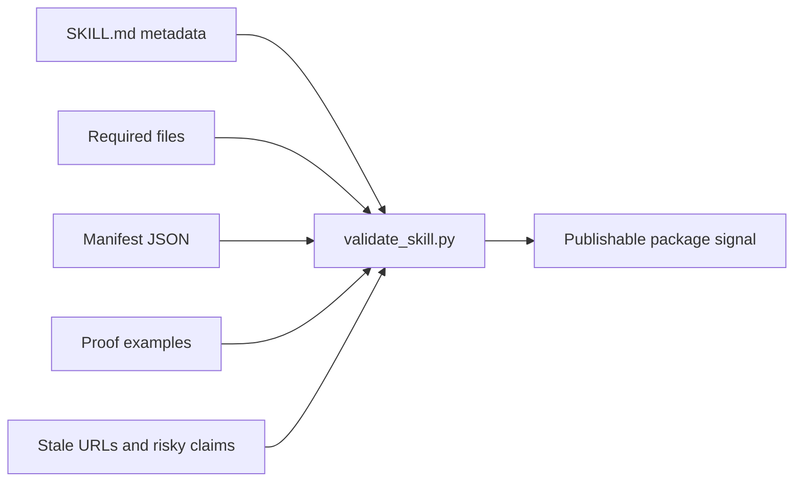

## Example Prompt

```text
Use the strategy consulting visualization skill to turn this board update into five slide specs:
- ARR grew from $10M to $15M over four quarters.
- Enterprise expansion contributed $3M.
- Churn reduced revenue by $0.5M.
- AI workflow adoption grew from 18% to 64%.
- Forecast risk is concentrated in implementation capacity.
```

See the proof set:

- [Board update input](examples/board-update-input.md)
- [Expected slide spec](examples/board-update-slide-spec.md)
- [Evaluation report](examples/evaluation-report.md)

## Proof Flow

The proof pack shows how a future marketplace reviewer or buyer can inspect the asset quickly.

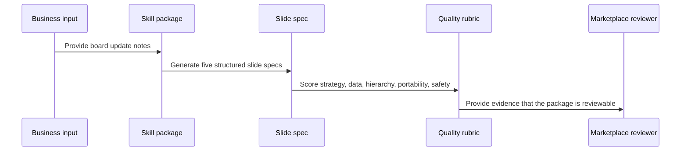

## Repository Map

```text
.
├── SKILL.md
├── references/
│   ├── style-system.md
│   ├── visualization-patterns.md
│   ├── prompt-templates.md
│   └── quality-rubric.md
├── examples/
│   ├── board-update-input.md
│   ├── board-update-slide-spec.md
│   └── evaluation-report.md
├── marketplace/
│   └── manifest.json
├── scripts/
│   └── validate_skill.py
├── MARKETPLACE.md
├── SECURITY.md
├── CHANGELOG.md
└── ROADMAP.md
```

## Marketplace Readiness

| Readiness Area | Status | Evidence |
| --- | --- | --- |
| Portable entrypoint | Ready | [SKILL.md](SKILL.md) |
| Progressive loading | Ready | [references/](references) |
| Proof examples | Ready | [examples/](examples) |
| Local validation | Ready | [validate_skill.py](scripts/validate_skill.py) |
| Marketplace metadata | Ready | [manifest.json](marketplace/manifest.json) |
| Storefront copy | Ready | [MARKETPLACE.md](MARKETPLACE.md) |
| Security posture | Ready | [SECURITY.md](SECURITY.md) |
| Product roadmap | Ready | [ROADMAP.md](ROADMAP.md) |
| Release history | Ready | [CHANGELOG.md](CHANGELOG.md) |

## Commercial Angle

This package is designed to become:

- a listed skill in future agent-skill marketplaces
- a premium template pack for executive visualization workflows
- a proof library for agents that create board-ready slide specs
- a foundation for later renderer or SaaS integration

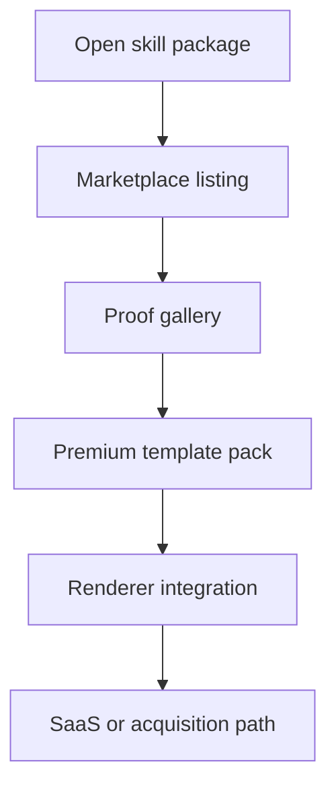

## Disclaimer

This is an independent skill package. It is not affiliated with, endorsed by, or sponsored by McKinsey & Company, Boston Consulting Group, Bain & Company, or any other consulting firm. Named firms may appear only as common style references or search terms.

## License

MIT. See [LICENSE](LICENSE).
